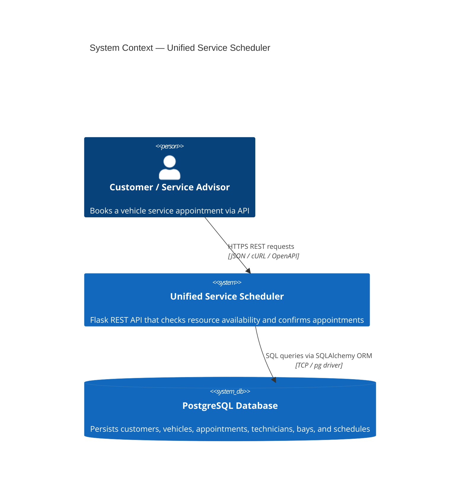
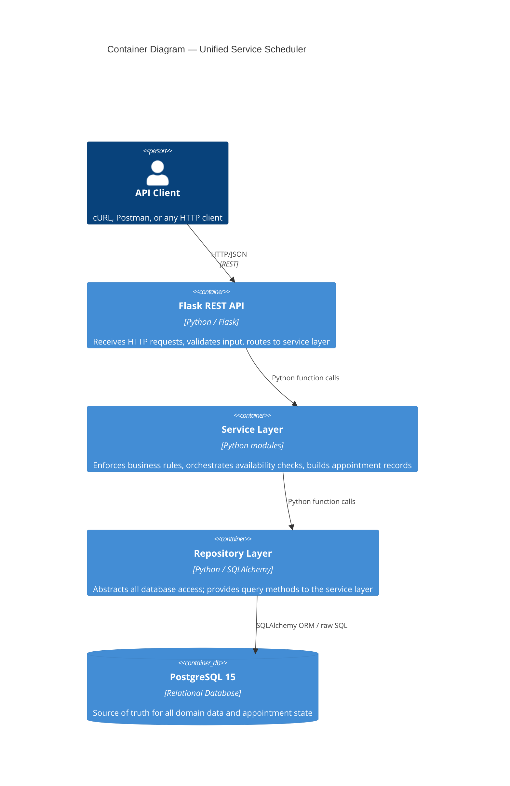
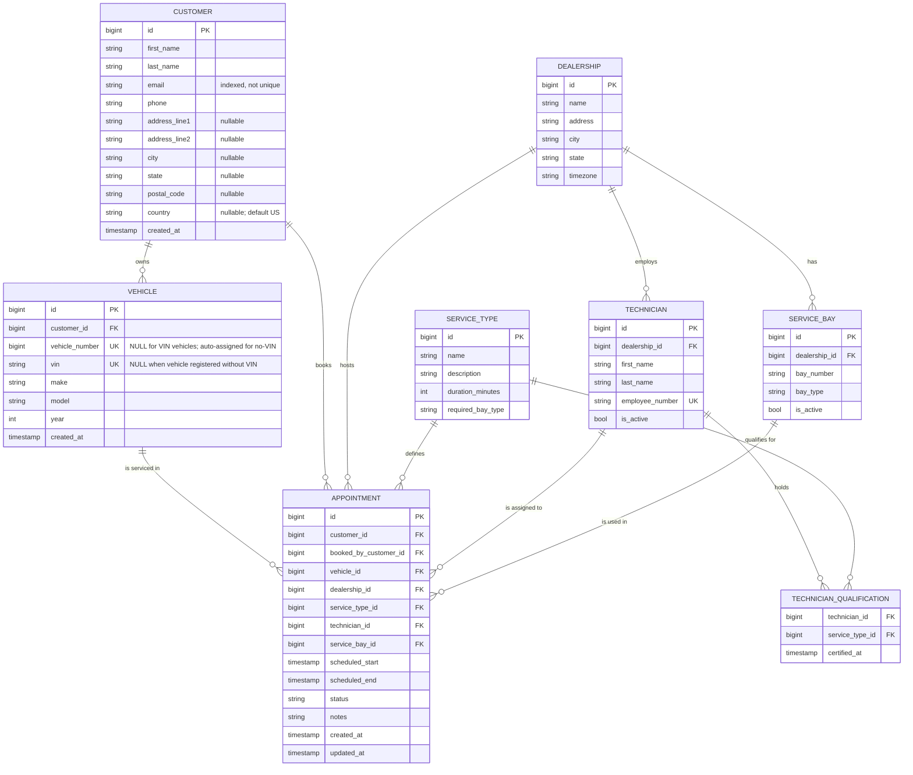

# System Design Document: Unified Service Scheduler
## Automotive Dealership Service Appointment Booking

**Version:** 1.2.0
**Date:** 2026-03-18
**Status:** Final

---

## Table of Contents

1. [Overview](#1-overview)
2. [Assumptions](#2-assumptions)
3. [Architecture Diagram](#3-architecture-diagram)
4. [Component Descriptions](#4-component-descriptions)
5. [Domain Model](#5-domain-model)
6. [Data Flow: Booking a Service Appointment](#6-data-flow-booking-a-service-appointment)
7. [Tech Stack and Justifications](#7-tech-stack-and-justifications)
8. [Key Design Decisions](#8-key-design-decisions)
9. [Availability Algorithm](#9-availability-algorithm)
10. [API Reference (OpenAPI Summary)](#10-api-reference-openapi-summary)
11. [Observability Strategy](#11-observability-strategy)
12. [Deployment & Scalability](#12-deployment--scalability)
13. [GenAI Collaboration](#13-genai-collaboration)
14. [Future Considerations](#14-future-considerations)

---

## 1. Overview

The Unified Service Scheduler is a backend REST API that enables automotive dealerships to accept, validate, and confirm service appointment bookings in real time. The system enforces two hard constraints before any appointment is confirmed:

1. **A qualified Technician is available** for the entire duration of the requested service.
2. **A ServiceBay compatible with the service type is available** for the same window.

If either resource is unavailable, the system returns the next available slot rather than failing silently. All confirmed appointments are persisted in PostgreSQL and are immediately reflected in subsequent availability checks.

The mock client interface is exposed via a documented OpenAPI specification and is exercisable with cURL examples. There is no frontend application; this document treats cURL and the OpenAPI spec as the client layer.

---

## 2. Assumptions

The following assumptions were made where requirements were ambiguous. Each assumption is documented so that reviewers can evaluate whether the interpretation is reasonable.

| # | Area | Assumption | Rationale |
|---|------|------------|-----------|
| A1 | **User Actor** | This API is an **internal tool used by Service Advisors** (dealership staff), not by end customers directly. Customers do not self-serve through this API. | The scenario says "replace manual booking systems" — the manual process is staff-operated. End-customer portals are a separate concern. |
| A2 | **Authentication** | Authentication (JWT scoped per dealership) is **out of scope for v1** and noted as a high-priority future enhancement. | The core evaluation criteria focus on booking logic and resource availability. Auth would add implementation noise without demonstrating the assessed skills. |
| A3 | **Business Hours** | The system enforces a **default operating window of 08:00–18:00** for all dealerships in v1. Specifically: `desired_start` must be ≥ 08:00, and `desired_start + duration_minutes` must be ≤ 18:00 (i.e., the appointment must **finish by** 18:00, not merely start before 18:00). A 90-minute Oil Change starting at 17:00 would end at 18:30 and is rejected. `GET /availability` generates slots only where the full window fits within this range. Per-dealership custom schedules require a `DealershipSchedule` entity and are a future enhancement. | A hardcoded default is cleaner than "no enforcement" — it prevents bookings at 03:00 AM and keeps the availability algorithm consistent. Requiring appointment completion (not just start) within business hours reflects real-world constraint: technicians do not work overtime. |
| A4 | **Technician Working Hours** | Technicians are assumed to be **available during all dealership operating hours**. There are no shift schedules or individual working-hour constraints in v1. | The requirements do not mention technician schedules. A `TechnicianSchedule` entity is noted as a future enhancement. |
| A5 | **No Slot Available** | When the desired time is unavailable, the API returns the **next available slot** (within a 14-day horizon) rather than returning a plain error. | A plain 409 with no guidance forces the client to retry blindly. Returning a suggestion is a better UX and demonstrates the availability algorithm. |
| A6 | **Appointment Modification** | Cancellation is part of the **intended appointment lifecycle and domain model** in v1 — the status transition `CONFIRMED → CANCELLED` is fully modelled and the overlap query correctly excludes `CANCELLED` appointments. However, the **HTTP cancel endpoint** (`DELETE /appointments/{id}`) is planned for the next release and not implemented in v1 scope. Reschedule is out of scope and would be modelled as cancel + create (either client-side or via a future convenience endpoint). | The assessment core is booking creation and resource availability. Cancel logic is already baked into the status model and overlap queries; surfacing it as an HTTP endpoint is a straightforward next step and is tracked in §14. |
| A7 | **Technician Assignment** | `technician_id` is **optional** in `POST /appointments`. If provided, the system validates the technician is qualified and available for the slot then assigns directly. If omitted, the system **auto-assigns the least-loaded qualified technician** (fewest confirmed appointments on the booking date — see §8.4). The intended flow is: client optionally calls `GET /dealerships/{dealership_id}/technicians` to pick a specific technician (Step 0c.5), then passes `technician_id` as a filter in the calendar/spot-check calls, and finally includes it in `POST /appointments`. | Giving Service Advisors the option to pre-select a technician matches real-world practice (customers who prefer a specific technician). Auto-assign with a fair workload distribution strategy ensures coverage when no preference is expressed. |
| A8 | **Bay Assignment** | Service bay is always **auto-assigned** — clients do not choose a bay. The system picks the first compatible available bay. | Bays are an internal operational resource; Service Advisors and customers have no meaningful preference between bays. |
| A9 | **Payment & Billing** | Payment, invoicing, and billing are **entirely out of scope**. | Not mentioned in the requirements. Belongs to a different domain (Operate/Finance). |
| A10 | **Notifications** | SMS/email notifications to customers on booking confirmation or cancellation are **out of scope for v1**. | Requires an async job queue (Celery + external provider). Noted as a high-priority future enhancement. |
| A11 | **Single Dealership per Appointment** | Each appointment belongs to exactly **one dealership**. Multi-location transfers or fleet-wide bookings are not supported. | The requirements specify "a specific dealership" as an input — singular. |
| A12 | **Appointment Status Flow** | Valid statuses are: `CONFIRMED`, `CANCELLED`, `COMPLETED`. `PENDING` is **not used** — a newly created appointment starts as `CONFIRMED` immediately (no manual confirmation step). Valid transitions: `CONFIRMED → CANCELLED`, `CONFIRMED → COMPLETED`. Attempting to cancel a `COMPLETED` appointment returns `422 Unprocessable Entity`. Operational states such as `CHECKED_IN`, `IN_PROGRESS`, and `NO_SHOW` are intentionally excluded — these belong to workshop management workflow, not the booking domain assessed here. | The requirements say "upon success, create a confirmed Appointment record" — immediate confirmation. PENDING would imply a 2-step workflow not mentioned in requirements. Operational workflow states are a future enhancement. |
| A13 | **Timezone** | All appointment timestamps are **stored in UTC**. Business-hour validation (`08:00–18:00`) and calendar slot generation are evaluated in the **dealership's local timezone** using `Dealership.timezone`, then converted to UTC for persistence and overlap checks. For example, a dealership in `America/Chicago` (UTC−5) has its business window treated as `13:00–23:00 UTC`; a booking at 09:00 local is stored as `14:00 UTC`. `booking_date` used as the advisory lock scope is also the local calendar date (not the UTC date). Client-facing datetime responses are returned in UTC with `Z` suffix; clients display local time using the `Dealership.timezone` field. | Storing UTC avoids ambiguity and DST storage edge cases. Validating business hours in local time is correct — a dealership that closes at 18:00 local does not care what UTC time that is. Deriving lock scope from local date is also correct — "same day" means the same working day at the dealership, not the same UTC calendar date. |
| A14 | **Phone Uniqueness** | Phone number is **not a hard unique constraint**. Multiple customers may share a phone (e.g. spouses, family). A phone lookup returning multiple results requires the advisor to disambiguate by name. Duplicate phone on `POST /customers` is allowed but a `warning` flag is returned alongside existing matches so the advisor can decide whether to create a new record or reuse an existing one. | Hard uniqueness would reject legitimate cases. Soft warning gives advisors the information they need to make the right decision. |
| A15 | **Vehicle Ownership & VIN** | `Vehicle.customer_id` represents the **current primary owner** but is not enforced during booking. Any customer can book a service for any vehicle (e.g. dropping off a spouse's car, fleet management). `POST /vehicles` with an existing VIN returns `409` with the existing vehicle record. **VIN is optional** — the system supports booking for vehicles with or without a VIN. All booking operations use `vehicle_id` (UUID) as the identifier; VIN is a display/lookup field only. Vehicles registered without a VIN receive a `vehicle_number` (BigInteger auto-increment) as a human-readable surrogate reference, encoded as `"V-000001"`. This provides a stable short reference that staff can relay to a customer verbally or display on printed paperwork, without exposing the internal UUID. | A vehicle awaiting delivery may not have a VIN yet but still needs a service booking. Forcing VIN presence would block legitimate cases. The `vehicle_number` surrogate fills the operational gap: advisors can say "your reference is V-000042" instead of reading out a UUID. A BigInteger index is significantly more efficient than a 36-char UUID string index for this supplementary lookup path. |
| A16 | **Technician Dealership Guard** | Even though `GET /availability` only returns technicians from the requested dealership, `POST /appointments` independently validates that the provided `technician_id` belongs to the same `dealership_id`. This server-side guard prevents manipulation by clients bypassing the availability check. | Defence in depth — the API layer should not trust that clients always follow the intended flow. |
| A17 | **Max Booking Horizon** | `desired_start` is accepted up to **90 days** in the future. Requests beyond 90 days return `400 Bad Request`. | Beyond 90 days, resource availability is too uncertain to be meaningful. Limits unbounded far-future bookings. |
| A18 | **No Availability Beyond Horizon** | If `find_next_slot` finds no opening within the 14-day search window, the API returns `200 OK` with `available: false`, `next_available_slot: null`, and `message: "No availability found within the 14-day search horizon. Please contact the dealership directly."` | A 503 would imply server error. This is a business state — the dealership is fully booked — communicated as a clear message. |
| A19 | **Calendar `from_date` in the Past or Present** | If `from_date` is today or in the past, the system auto-adjusts the search start to **now + 1 hour** (rounded up to the next 30-min slot boundary). Past slots are never returned. | Returning already-passed slots would be misleading. Adding 1 hour ensures the earliest bookable slot has enough preparation lead time. |

---

## 3. Architecture Diagram

### 3.1 System Context (C4 Level 1)



### 3.2 Container Diagram (C4 Level 2)



### 3.3 Full Booking Flow (Sequence)

```mermaid
sequenceDiagram
    autonumber
    participant C as Client (cURL)
    participant R as Flask Route
    participant DS as DealershipService
    participant CS as CustomerService
    participant VS as VehicleService
    participant AS as AvailabilityService
    participant S as AppointmentService
    participant DR as DealershipRepository
    participant CR as CustomerRepository
    participant VR as VehicleRepository
    participant STR as ServiceTypeRepository
    participant TR as TechnicianRepository
    participant BR as BayRepository
    participant AR as AppointmentRepository
    participant DB as PostgreSQL

    Note over C,DB: STEP 0 — Select Dealership
    C->>R: GET /dealerships?q=metro
    R->>DS: search_by_name(q)
    DS->>DR: search_by_name(q)
    DR->>DB: SELECT dealerships WHERE name ILIKE ?
    DB-->>DR: List[Dealership]
    DR-->>DS: List[Dealership]
    DS-->>R: List[Dealership]
    R-->>C: 200 OK { data: [{ id, name, city, state, timezone }] }

    Note over C,DB: STEP 0a — Find or Register Customer
    C->>R: GET /customers?phone=+1-555-0101
    R->>CS: search_by_phone(phone)
    CS->>CR: get_by_phone(phone)
    CR->>DB: SELECT customers WHERE phone = ?
    DB-->>CR: List[Customer] (0, 1, or many if shared number)

    alt Customer(s) found → load profile + vehicles in one call
        CR-->>CS: List[Customer]
        CS-->>R: List[Customer]
        R-->>C: 200 OK { data: [{ id, first_name, last_name, email, phone }] } (advisor picks correct one if multiple)
        C->>R: GET /customers/{customer_id}?include=vehicles
        R->>CS: get_by_id(customer_id)
        CS->>CR: get_by_id(customer_id)
        CR->>DB: SELECT customers WHERE id = ?
        DB-->>CR: Customer
        CR-->>CS: Customer
        CS-->>R: Customer
        Note over R: include=vehicles → VehicleService.list_by_customer()
        R->>VS: list_by_customer(customer_id)
        VS->>VR: list_by_customer(customer_id)
        VR->>DB: SELECT vehicles WHERE customer_id = ? ORDER BY created_at ASC
        DB-->>VR: [Vehicle, ...]
        VR-->>VS: list
        VS-->>R: list
        R-->>C: 200 OK { customer: { ...fields, vehicles: [...] } }
        Note over C: vehicles[] drives Step 0b decision tree<br/>(0 → register new, 1 → auto-select, >1 → show picker)
        opt Info outdated → update
            C->>R: PATCH /customers/{customer_id} { phone, address, ... }
            R->>CS: update_customer(id, data)
            CS->>CR: update(id, data)
            CR->>DB: UPDATE customers SET ... WHERE id = ?
            DB-->>CR: Customer
            CR-->>CS: Customer
            CS-->>R: Customer (+ warning if duplicate phone)
            R-->>C: 200 OK { customer, warning? }
        end
    else Customer not found → register new
        CR-->>CS: None
        CS-->>R: None
        R-->>C: 200 OK { data: [] }
        C->>R: POST /customers { first_name, last_name, email, phone, address? }
        R->>CS: create_customer(data)
        CS->>CR: insert(customer)
        CR->>DB: INSERT INTO customers
        DB-->>CR: Customer
        CR-->>CS: Customer
        CS-->>R: Customer (+ warning if duplicate phone)
        R-->>C: 201 Created { customer, warning? }
        Note over C: New customer has no vehicles → go straight to register vehicle form
    end

    Note over C,DB: STEP 0b — Select or Register Vehicle (vehicles[] already loaded above)

    alt Customer has existing vehicles (vehicles.length > 0)
        Note over C: UI shows picker:<br/>"Use existing vehicle" list + "Register new vehicle" option
        alt Advisor selects an existing vehicle
            Note over C: Vehicle id already known — skip lookup
            opt Info outdated (e.g. ownership transfer)
                C->>R: PATCH /vehicles/{vehicle_id} { customer_id, make, model, year }
                R->>VS: update(vehicle_id, data)
                VS->>VR: update(vehicle, data)
                VR->>DB: UPDATE vehicles SET ... WHERE id = ?
                DB-->>VR: Vehicle
                VR-->>VS: Vehicle
                VS-->>R: Vehicle
                R-->>C: 200 OK { vehicle }
            end
        else Advisor registers a new vehicle
            C->>R: POST /vehicles { customer_id, vin?, make, model, year }
            R->>VS: create(data)
            VS->>VR: create(...)
            VR->>DB: INSERT INTO vehicles
            DB-->>VR: Vehicle (vehicle_number auto-assigned if no VIN)
            VR-->>VS: Vehicle
            VS-->>R: Vehicle
            R-->>C: 201 Created { vehicle }
        end
    else Customer has no vehicles (total = 0)
        Note over C: UI goes straight to "Register new vehicle" form
        opt Advisor knows VIN / V-XXXXXX ref — look up first
            C->>R: GET /vehicles/{VIN | ID | V-XXXXXX}
            R->>VS: get_by_identifier(identifier)
            Note over VS: numeric → get_by_id<br/>17-char VIN → get_by_vin<br/>V-XXXXXX → get_by_vehicle_number<br/>other → 400
            VS->>VR: appropriate lookup
            VR->>DB: SELECT vehicles WHERE ...
            DB-->>VR: Vehicle or None
            VR-->>VS: Vehicle or None
            VS-->>R: Vehicle or NotFoundError
            R-->>C: 200 OK { vehicle } or 404 Not Found
        end
        C->>R: POST /vehicles { customer_id, vin?, make, model, year }
        R->>VS: create(data)
        VS->>VR: create(...)
        VR->>DB: INSERT INTO vehicles
        DB-->>VR: Vehicle
        VR-->>VS: Vehicle
        VS-->>R: Vehicle
        R-->>C: 201 Created { vehicle }
    end

    Note over C,DB: STEP 0c — Select Service Type
    C->>R: GET /service-types
    R->>STR: list_all()
    STR->>DB: SELECT * FROM service_types
    DB-->>STR: List[ServiceType]
    STR-->>R: List[ServiceType]
    R-->>C: 200 OK { data: [ { id, name, description, duration_minutes, required_bay_type } ] }

    Note over C,DB: STEP 0c.5 — Select Technician (Optional)
    opt Advisor or customer requests a specific technician
        C->>R: GET /dealerships/{dealership_id}/technicians?service_type_id=
        R->>AS: list_qualified_technicians(dealership_id, service_type_id)
        AS->>TR: list_qualified(dealership_id, service_type_id)
        TR->>DB: SELECT technicians WHERE qualified AND active
        DB-->>TR: List[Technician]
        TR-->>AS: List[Technician]
        AS-->>R: List[Technician]
        R-->>C: 200 OK { data: [{ id, name, employee_number }] }
        Note over C: Advisor picks preferred technician → technician_id held client-side
    end

    Note over C,DB: STEP 0d-1 — Calendar View (Browse Available Slots)
    C->>R: GET /dealerships/{dealership_id}/availability?service_type_id=&from_date=&days=15[&technician_id=]
    R->>AS: get_calendar_slots(dealership_id, service_type_id, from_date, days, technician_id?)
    Note over AS,TR,BR,AR: Load all data for full date range upfront — 3 queries total
    AS->>TR: load_qualified_technicians(dealership_id, service_type_id, technician_id?)
    TR->>DB: SELECT technicians WHERE qualified AND active [AND id = :technician_id]
    DB-->>TR: List[Technician]
    TR-->>AS: List[Technician]
    AS->>BR: load_compatible_bays(dealership_id, bay_type)
    BR->>DB: SELECT service_bays WHERE bay_type = ? AND active
    DB-->>BR: List[Bay]
    BR-->>AS: List[Bay]
    AS->>AR: load_booked_intervals(dealership_id, from_date, to_date)
    AR->>DB: SELECT technician_id, service_bay_id, scheduled_start, scheduled_end WHERE CONFIRMED in range
    DB-->>AR: List[Interval]
    AR-->>AS: booked intervals map { resource_id → [(start, end)] }
    Note over AS: In-memory slot generation — no further DB calls<br/>For each 30-min slot: check overlap using pre-loaded intervals
    AS-->>R: slots grouped by date { date, available_times: [{ start, end, technician_count }] }
    R-->>C: 200 OK { slots: [...], filtered_technician?: { id, name } }

    Note over C,DB: STEP 0d-2 — Spot Check (Confirm Slot + Technician List)
    C->>R: GET /dealerships/{dealership_id}/availability?service_type_id=&desired_start=[&technician_id=]
    R->>AS: check_slot(dealership_id, service_type_id, desired_start, technician_id?)
    AS->>TR: find_available(dealership_id, service_type_id, window_start, window_end, technician_id?)
    Note over TR,DB: technician_id provided → check only that technician<br/>technician_id omitted  → return all available technicians
    TR->>DB: SELECT technicians WHERE NOT EXISTS overlapping appointment (NOT EXISTS subquery)
    DB-->>TR: List[Technician] (1 entry max when filtered)
    AS->>BR: find_available(dealership_id, bay_type, window_start, window_end)
    BR->>DB: SELECT bays WHERE NOT EXISTS overlapping appointment (NOT EXISTS subquery)
    DB-->>BR: List[Bay]
    AS-->>R: { available, available_technicians[], bay_available, next_available_slot? }
    R-->>C: 200 OK { available, available_technicians: [{ id, name, employee_number }], bay_available, next_available_slot? }

    Note over C,DB: STEP 1–8 — Confirm Appointment (Phase 2)
    C->>R: POST /appointments { customer_id, vehicle_id, dealership_id, service_type_id, desired_start, technician_id? }
    R->>S: create_appointment(booking_request)
    S->>STR: get_service_type(service_type_id)
    STR->>DB: SELECT service_types WHERE id = ?
    DB-->>STR: ServiceType (duration_minutes, required_bay_type)
    STR-->>S: ServiceType

    alt technician_id provided by client
        S->>TR: validate_and_get(technician_id, service_type_id, window_start, window_end)
        TR->>DB: SELECT technician WHERE qualified AND no overlap (JOIN appointments)
        DB-->>TR: Technician or None
    else technician_id omitted — auto-assign (least-loaded-today)
        S->>TR: find_least_loaded_available(dealership_id, service_type_id, window_start, window_end)
        TR->>DB: SELECT technician WHERE qualified AND no overlap ORDER BY bookings_today ASC LIMIT 1
        DB-->>TR: Technician or None
    end

    S->>BR: find_available_bay(dealership_id, bay_type, window_start, window_end)
    BR->>DB: SELECT first bay WHERE compatible AND no overlap (JOIN appointments)
    DB-->>BR: ServiceBay or None

    alt Both technician AND bay available
        S->>AR: create_appointment(...)
        AR->>DB: SELECT pg_advisory_xact_lock(hashtext('tech:{technician_id}:{booking_date}'))
        AR->>DB: SELECT pg_advisory_xact_lock(hashtext('bay:{service_bay_id}:{booking_date}'))
        AR->>DB: INSERT INTO appointments
        DB-->>AR: Appointment
        AR-->>S: Appointment
        S-->>R: Appointment DTO
        R-->>C: 201 Created { appointment: { id, status: CONFIRMED, technician, service_bay, scheduled_start, scheduled_end, ... } }
    else Resource unavailable (race condition edge case)
        S->>AS: find_next_slot(dealership_id, service_type_id, desired_start)
        AS-->>S: next_available_slot
        S-->>R: ResourceUnavailableError
        R-->>C: 409 Conflict { next_available_slot }
    end
```

---

## 4. Component Descriptions

### 4.1 Flask REST API Layer (`app/routes/`)

The entry point for all external HTTP traffic. Responsibilities:

- **Routing:** Maps HTTP verbs and URL patterns to handler functions.
- **Request parsing:** Deserializes JSON payloads from the request body.
- **Input validation:** Uses `marshmallow` schemas to enforce required fields, data types, and basic domain constraints (e.g., `desired_time` must be in the future).
- **Error formatting:** Translates domain exceptions into structured JSON error responses with appropriate HTTP status codes.
- **Response serialization:** Converts service layer return values (domain objects or DTOs) into JSON responses.

The route layer contains no business logic. It is intentionally thin.

**Key routes:**

**v1 — Implemented**

| Method | Path | Description |
|--------|------|-------------|
| `POST` | `/appointments` | Book a new service appointment |
| `GET` | `/dealerships` | Search dealerships by name (typeahead) |
| `GET` | `/dealerships/{dealership_id}/availability` | Calendar view or spot check availability (optional `technician_id` filter) |
| `GET` | `/dealerships/{dealership_id}/technicians` | List qualified technicians for a service type (Step 0c.5) |
| `POST` | `/customers` | Register a customer |
| `GET` | `/customers` | Search customers by phone (exact) or name (typeahead) |
| `GET` | `/customers/{customer_id}` | Get full customer profile. `?include=vehicles` embeds the vehicle list in one call. |
| `PATCH` | `/customers/{customer_id}` | Update customer info (name, phone, email, address) |
| `POST` | `/vehicles` | Register a vehicle |
| `GET` | `/vehicles/{identifier}` | Get vehicle by VIN, numeric ID, or V-XXXXXX ref (auto-detected) |
| `PATCH` | `/vehicles/{vehicle_id}` | Update vehicle info (make, model, year, customer_id) |
| `GET` | `/service-types` | List / search service types by name (typeahead) |
| `GET` | `/openapi.json` | OpenAPI 3.1 specification (machine-readable) |
| `GET` | `/swagger-ui` | Swagger UI (interactive API documentation browser) |
| `GET` | `/health` | Health check endpoint |

**Planned — Future Releases**

| Method | Path | Description | Priority |
|--------|------|-------------|----------|
| `GET` | `/appointments` | List appointments by date / dealership | Medium |
| `GET` | `/appointments/{appointment_id}` | Retrieve appointment details | Medium |
| `DELETE` | `/appointments/{appointment_id}` | Cancel an appointment | Medium |
| `POST` | `/appointments/{appointment_id}/reschedule` | Reschedule (cancel + rebook in one call) | Medium |
| `PATCH` | `/vehicles/{vehicle_id}/vin` | Assign or update VIN on an existing vehicle | Medium |
| `GET` | `/technicians` | Global unscoped technician list (cross-dealership admin use) | Low |

---

### 4.2 Service Layer (`app/services/`)

The business logic core. The service layer is where the domain rules live and is entirely independent of HTTP or database concerns. This makes it straightforward to unit test.

**`DealershipService`** — dealership lookup:

- Typeahead search by name. Thin wrapper around `DealershipRepository` — no business rules, but kept in the service layer for architectural consistency.

**`CustomerService`** — customer management:

- Search by phone (exact) or name (typeahead).
- Create new customer; check for duplicate phone and attach `warning` if found.
- Update customer fields (partial PATCH); re-check phone uniqueness on update.

**`VehicleService`** — vehicle management:

- Lookup by identifier: auto-routes based on format — `get_by_id` (numeric), `get_by_vin` (17-char VIN), or `get_by_vehicle_number` (`V-XXXXXX` reference). Any other format → `400`.
- Register new vehicle; return `409` with existing record if VIN already exists. Auto-assigns `vehicle_number` (BigInt) for VIN-less vehicles.
- Update vehicle fields including ownership transfer (`customer_id`).

**`AppointmentService`** — primary orchestrator:

- Loads the `ServiceType` to determine `duration_minutes` and `required_bay_type`.
- Computes the appointment window: `[desired_time, desired_time + duration_minutes]`.
- Delegates availability queries to repositories.
- Enforces the dual-resource constraint (technician AND bay must both be free for the full window).
- Writes the confirmed `Appointment` record atomically.
- Suggests the next available slot if either resource is unavailable.

**`AvailabilityService`** — slot suggestion helper:

- Iterates forward from the desired time in configurable increments (default: 30 minutes) to find the earliest slot where both a qualified technician and a compatible bay are simultaneously free.
- Caps the search horizon (default: 14 days) to avoid unbounded iteration.

---

### 4.3 Repository Layer (`app/repositories/`)

The data-access abstraction layer. Each repository handles one or a small group of closely related domain entities. Repositories expose domain-oriented query methods rather than raw SQL or ORM queries, which decouples the service layer from persistence implementation details.

| Repository | Responsibilities |
|---|---|
| `AppointmentRepository` | CRUD for `Appointment`; overlap detection query |
| `TechnicianRepository` | Find qualified + available technicians |
| `ServiceBayRepository` | Find compatible + available bays |
| `CustomerRepository` | CRUD for `Customer` |
| `VehicleRepository` | CRUD for `Vehicle` |
| `DealershipRepository` | Read dealership and its resources |
| `ServiceTypeRepository` | Read service type catalog |

Each repository receives the SQLAlchemy `Session` via dependency injection (passed through from the Flask request context), ensuring all repository calls within a single request share the same transaction.

---

### 4.4 PostgreSQL Database

The single source of truth. PostgreSQL was chosen over alternatives for its strong transactional guarantees, advisory locking support, and mature ecosystem. The database schema is managed via Alembic migrations.

---

## 5. Domain Model

### 5.1 Entity-Relationship Diagram



### 5.2 Entity Descriptions

**Customer** — A person who books appointments. Identified by email (unique). Phone is indexed for lookup but not unique — spouses or family members may share a number. A `warning` is returned on `POST /customers` if an existing record shares the same phone. Optional address fields (`address_line1`, `address_line2`, `city`, `state`, `postal_code`, `country`) capture the customer's mailing/residential address; all are nullable and `country` defaults to `"US"`. Address information is stored for reference and record-keeping and can be updated at any time via `PATCH /customers/{id}`.

**Vehicle** — A physical car. `customer_id` records the current primary owner but is not enforced during booking — anyone can book a service for any vehicle. Multiple vehicles per customer are supported.

Two identifier fields beyond the primary UUID:
- **`vin`** (optional, unique) — 17-character Vehicle Identification Number. `POST /vehicles` with an existing VIN returns `409` with the existing record. `null` for vehicles registered without a VIN.
- **`vehicle_number`** (optional, unique, BigInteger) — auto-assigned only when `vin` is `null`. Provides a short human-readable surrogate reference encoded as `"V-000001"` (zero-padded 6-digit, `V-` prefix). `null` for vehicles that have a VIN. A BigInt index (8 bytes) is used instead of a UUID string index (36 chars) for this supplementary lookup path.

**Dealership** — A physical service location. Owns a pool of technicians and service bays. Stores a timezone string to correctly interpret business hours.

**ServiceType** — A catalog entry for a type of service (e.g., "Oil Change", "Brake Inspection"). Drives two critical constraints:
- `duration_minutes`: how long the appointment will take, defining the blocked time window.
- `required_bay_type`: the category of bay needed (e.g., `"LIFT"`, `"ALIGNMENT"`, `"GENERAL"`).

**Technician** — A dealership employee who performs service. Active flag supports soft-delete. Linked to service types via a many-to-many join through `TechnicianQualification`.

**TechnicianQualification** — Join table expressing which service types a technician is certified to perform. Includes a `certified_at` timestamp for audit purposes.

**ServiceBay** — A physical workspace within a dealership. Has a `bay_type` that must match the `required_bay_type` of the service type.

**Appointment** — The central domain object. Captures the confirmed booking with references to all domain entities, plus `scheduled_start`, `scheduled_end`, and `status` (`CONFIRMED`, `CANCELLED`, `COMPLETED`). Starts as `CONFIRMED` immediately on creation — no `PENDING` state.

Two customer references are stored separately:
- `customer_id` — the vehicle's primary owner (who the service is **for**)
- `booked_by_customer_id` — who made the booking on the customer side (may differ — e.g. a spouse dropping off the car, a fleet manager booking for a driver)

> **Domain naming note:** `booked_by_customer_id` is **customer-side attribution only**. The actual record is always created by the Service Advisor (internal staff — see A1). In v1, without auth (A2), there is no way to capture the internal advisor identity; `booked_by_customer_id` records which customer initiated the request. When JWT auth is added (§14), a separate `created_by_user_id` (advisor/account) will be added and populated server-side from the session token — at that point `booked_by_customer_id` becomes optional again.

This supports audit trail ("who requested this?") without restricting who can book for whom.

---

## 6. Data Flow: Booking a Service Appointment

The full booking flow has two phases: **Pre-check** (browse and select) then **Confirm** (submit). This design ensures the Service Advisor has all the information needed before submitting, minimising 409 errors to edge cases only (race conditions).

### Overview

```
┌─────────────────────────────────────────────────────────────┐
│  PHASE 1 — PRE-CHECK (Browse & Select)                      │
│                                                             │
│  Step 0:  GET /dealerships?q=<name>                         │
│           → Returns: id, name, city, state, timezone        │
│           → Typeahead — advisor selects dealership          │
│                                                             │
│  Step 0a: GET /customers?phone= or ?q=                      │
│           → Returns: id, first_name, last_name, email, phone│
│           → Phone may return multiple (shared) — advisor    │
│             picks correct one, then:                        │
│           → FOUND? → GET /customers/{customer_id}           │
│                    → PATCH /customers/{customer_id} (update)│
│           → NOT FOUND? → POST /customers (register new)     │
│                                                             │
│  Step 0b: GET /customers/{customer_id}?include=vehicles      │
│           (already called in Step 0a for returning customer) │
│           → vehicles[] embedded in customer response        │
│           → MULTIPLE? → advisor/UI lets user pick one        │
│           → NONE or NEW? → advisor looks up by VIN/ref or   │
│             registers: POST /vehicles                        │
│           → FOUND by identifier? →                          │
│             GET /vehicles/{VIN | UUID | V-XXXXXX}           │
│           → Update if needed: PATCH /vehicles/{vehicle_id}  │
│                                                             │
│  Step 0c: GET /service-types?q=<name>                       │
│           → Returns: id, name, description,                 │
│                      duration_minutes, required_bay_type    │
│           → Typeahead — advisor picks service type          │
│                                                             │
│  Step 0c.5 (optional): GET /dealerships/{id}/technicians    │
│             ?service_type_id=                               │
│             → List qualified technicians for that service   │
│             → Advisor/customer picks preferred technician   │
│             → If skipped → system auto-assigns at booking   │
│                                                             │
│  Step 0d-1: GET /dealerships/{dealership_id}/availability   │
│             ?service_type_id=&from_date=&days=15            │
│             [&technician_id=]  ← optional filter           │
│             → Calendar: slots where chosen/any tech is free │
│                                                             │
│  Step 0d-2: GET /dealerships/{dealership_id}/availability   │
│             ?service_type_id=&desired_start=                │
│             [&technician_id=]  ← optional filter           │
│             → Spot check: confirm slot + technician list    │
└─────────────────────────────────────────────────────────────┘
                          │
                          ▼
┌─────────────────────────────────────────────────────────────┐
│  PHASE 2 — CONFIRM (Submit Appointment)                     │
│                                                             │
│  Step 1–8: POST /appointments                               │
│            { ..., technician_id (optional) }               │
│            → Validate → Assign resources → Persist          │
└─────────────────────────────────────────────────────────────┘
```

---

### Phase 1 — Pre-check

#### Step 0 — Select Dealership

Advisor selects which dealership the customer will bring the vehicle to. Typeahead by dealership name.

```bash
GET /dealerships?q=metro&limit=10
```

**Response:**
```json
{
  "data": [
    { "id": "uuid-...", "name": "Metro Honda Service Center", "city": "Austin", "state": "TX" },
    { "id": "uuid-...", "name": "Metro Toyota", "city": "Austin", "state": "TX" }
  ]
}
```

Advisor selects the correct dealership and obtains `dealership_id` used in all subsequent calls.

---

#### Step 0a — Find or Register Customer

Customer walks in or calls. Advisor looks them up first — by phone (preferred, fast) or by name (fallback).

```bash
# Primary: phone lookup — exact match, fast (usually 1 result, may return multiple if shared)
GET /customers?phone=+1-555-0101

# Fallback: name typeahead
GET /customers?q=smi&limit=10
```

**Returning customer:** Advisor selects from search results → system loads full profile:

```bash
GET /customers/{customer_id}
```

Loads customer details into the booking form. Advisor confirms info is up to date. If anything changed (new phone, new email):

```bash
PATCH /customers/{customer_id} { "phone": "+1-555-0200" }
```

**New customer (not found):** Advisor registers them on the spot:

```bash
POST /customers
{
  "first_name": "John",
  "last_name":  "Doe",
  "email":      "john.doe@email.com",
  "phone":      "+1-555-0199",
  "address_line1": "123 Main St",
  "city":          "Springfield",
  "state":         "IL",
  "postal_code":   "62701",
  "country":       "US"
}
```

Returns the new customer record with `customer_id`. If the phone number already exists on another record, a `warning.DUPLICATE_PHONE` block is included — advisor verifies whether it is a shared family number or a data entry error.

**Existing customer with outdated info:** Advisor updates their details inline:

```bash
PATCH /customers/{customer_id}
{
  "phone": "+1-555-0200",
  "email": "john.new@email.com"
}
```

Same duplicate phone warning applies if the new number already belongs to another customer.

---

#### Step 0b — Select or Register Vehicle

The vehicle list is **already available** from Step 0a — it was embedded in the customer response via `?include=vehicles`. No additional call is needed.

```bash
# Step 0a already returns this (vehicles[] inside the customer object):
GET /customers/{customer_id}?include=vehicles
```

**Embedded vehicles in the customer response:**
```json
{
  "customer": {
    "id": "uuid-...", "first_name": "Jane", "...",
    "vehicles": [
      { "id": "uuid-...", "vin": "1HGCM82633A123456", "make": "Honda", "model": "Accord", "year": 2022, "vehicle_ref": null },
      { "id": "uuid-...", "vin": null, "make": "Toyota", "model": "Camry", "year": 2020, "vehicle_number": 42, "vehicle_ref": "V-000042" }
    ]
  }
}
```

**Decision tree based on `vehicles.length`:**

| length | UI action |
|--------|-----------|
| **0** | Go straight to "Register new vehicle" form |
| **1** | Auto-select the single vehicle (still show option to register new) |
| **> 1** | Show picker — advisor/customer chooses which car is being serviced |

**Path A — Use existing vehicle:** Vehicle `id` is already known from the list. If details are outdated:

```bash
PATCH /vehicles/{vehicle_id}
{ "customer_id": "new-owner-uuid", "year": 2023 }
```

**Path B — Register new vehicle (no VIN):** Customer calls in and doesn't know their VIN yet.

```bash
POST /vehicles
{
  "customer_id": "a1b2c3d4-...",
  "make": "Toyota", "model": "Camry", "year": 2020
}
# Response includes auto-assigned vehicle_number and vehicle_ref:
# { "vehicle": { "id": "...", "vehicle_number": 42, "vehicle_ref": "V-000042", "vin": null, ... } }
```

**Path C — Register new vehicle (with VIN):** Advisor scans or enters VIN.

```bash
POST /vehicles
{
  "customer_id": "a1b2c3d4-...",
  "vin":   "1HGCM82633A123456",
  "make":  "Honda", "model": "Accord", "year": 2022
}
```

> If the VIN already exists in the system, `409` is returned with the existing vehicle record — no duplicate created.

**Path D — Look up by identifier (advisor has VIN/ref from external source):**

```bash
# Advisor has the VIN written on the work order
GET /vehicles/1HGCM82633A123456

# Advisor has the V-XXXXXX reference from a previous visit's printout
GET /vehicles/V-000042
```

> **Auto-detection:** The single `GET /vehicles/{identifier}` endpoint detects the identifier type by format:
> - UUID pattern (`xxxxxxxx-xxxx-xxxx-xxxx-xxxxxxxxxxxx`) → looks up by `vehicle.id`
> - 17-char VIN pattern (`[A-HJ-NPR-Z0-9]{17}`) → looks up by `vehicle.vin`
> - `V-XXXXXX` pattern (`V-` prefix + 1–10 digits, case-insensitive) → looks up by `vehicle.vehicle_number`
> - Anything else → `400 Bad Request`

---

#### Step 0c — Select Service Type

Customer describes the issue. Advisor consults the service type catalog to pick the appropriate type.

```bash
GET /service-types
```

Returns all service types with `duration_minutes` and `required_bay_type`. Advisor selects (e.g., "Brake Inspection — 90 min") and obtains `service_type_id`.

---

#### Step 0c.5 — Select Technician (Optional)

If the customer has a preference ("I always come to Carlos"), the advisor can fetch the list of qualified technicians for the chosen service type first, then filter the calendar to that specific technician.

```bash
GET /dealerships/i9j0k1l2-.../technicians?service_type_id=m3n4o5p6-...
```

**Response:**
```json
{
  "data": [
    { "id": "uuid-t1", "name": "Carlos Reyes",  "employee_number": "T-001" },
    { "id": "uuid-t2", "name": "Maria Santos",  "employee_number": "T-004" },
    { "id": "uuid-t3", "name": "James Okafor",  "employee_number": "T-007" }
  ]
}
```

The advisor picks the preferred technician and passes `technician_id` as an optional filter in Steps 0d-1 and 0d-2. If skipped, the system behaves as before — any qualified technician is considered and the least-loaded is auto-assigned at booking time.

---

#### Step 0d-1 — Calendar View (Browse Available Slots)

```bash
# Without technician filter — show slots where ANY qualified technician is free
GET /dealerships/i9j0k1l2-.../availability
  ?service_type_id=m3n4o5p6-...
  &from_date=2026-03-20
  &days=15

# With technician filter — show slots where ONLY Carlos is free
GET /dealerships/i9j0k1l2-.../availability
  ?service_type_id=m3n4o5p6-...
  &from_date=2026-03-20
  &days=15
  &technician_id=uuid-t1
```

> **`from_date` in the past or today:** The system auto-adjusts the search start to **now + 1 hour**, rounded up to the next 30-minute boundary. Past slots are never returned (see Assumption A19).

Returns free slots grouped by date for the next N days. A slot is included in `available_times` **only when both conditions are met**:
- `technician_count > 0` — at least one qualified technician is free for the full window (or the specific chosen technician is free when `technician_id` is provided)
- At least one compatible bay is available for the full window

When `technician_id` is provided, `technician_count` is always **0 or 1** (that specific technician's availability). Slots where that technician is busy are excluded, even if other technicians are free.

Slots that fail either condition are **excluded entirely** — the advisor only sees bookable slots. Days where no slot passes both conditions show `available_times: []` (fully booked day).

```json
{
  "filtered_technician": { "id": "uuid-t1", "name": "Carlos Reyes" },
  "slots": [
    {
      "date": "2026-03-20",
      "available_times": [
        { "start": "2026-03-20T09:00:00", "end": "2026-03-20T10:30:00", "technician_count": 1 },
        { "start": "2026-03-20T11:00:00", "end": "2026-03-20T12:30:00", "technician_count": 1 }
      ]
    },
    {
      "date": "2026-03-22",
      "available_times": []
    }
  ]
}
```

> `filtered_technician` is only present in the response when `technician_id` was provided. When absent, `technician_count` reflects all qualified technicians ("only 1 left" is still meaningful context without pre-selection).

> A slot showing `technician_count: 1` means exactly one technician is free (or, when filtered, that chosen technician is free). If that technician gets booked by someone else between Step 0d-1 and Step 0d-2 (race condition), Step 0d-2 will return `available: false` with a `next_available_slot` suggestion.

The Advisor and customer pick a date and time from the calendar.

---

#### Step 0d-2 — Spot Check (Confirm Slot + Technician List)

```bash
# Without filter — returns ALL available technicians for that slot
GET /dealerships/i9j0k1l2-.../availability
  ?service_type_id=m3n4o5p6-...
  &desired_start=2026-03-20T09:00:00

# With filter — confirms whether Carlos specifically is still free
GET /dealerships/i9j0k1l2-.../availability
  ?service_type_id=m3n4o5p6-...
  &desired_start=2026-03-20T09:00:00
  &technician_id=uuid-t1
```

Called once the user has selected a slot from the calendar. Returns the available technician list for that exact window.

- **Without `technician_id`:** Advisor can offer the customer a choice ("Would you prefer Carlos or Maria?") or leave `technician_id` blank at POST to auto-assign.
- **With `technician_id`:** Confirms that the pre-selected technician is still free. `available_technicians` will contain only that one technician (or be empty if they were booked in the interim).

```json
{
  "available": true,
  "available_technicians": [
    { "id": "uuid-t1", "name": "Carlos Reyes", "employee_number": "T-001" },
    { "id": "uuid-t2", "name": "Maria Santos", "employee_number": "T-004" }
  ],
  "bay_available": true,
  "next_available_slot": null
}
```

> If `available: false` (slot was taken between calendar view and spot check — rare race condition), `next_available_slot` is provided and the Advisor returns to the calendar. When `technician_id` was filtered and that technician is now busy but others are free, `available: false` still fires because the customer's chosen technician is unavailable — the advisor can either accept a different slot from `next_available_slot` or go back and pick a different technician.

---

### Phase 2 — Confirm Appointment

#### Step 1 — Client Constructs Request

```bash
curl -X POST http://localhost:5000/appointments \
  -H "Content-Type: application/json" \
  -d '{
    "customer_id":    "a1b2c3d4-...",
    "vehicle_id":     "e5f6g7h8-...",
    "dealership_id":  "i9j0k1l2-...",
    "service_type_id":"m3n4o5p6-...",
    "desired_start":  "2026-03-20T09:00:00",
    "technician_id":  "uuid-t1",
    "notes": "Hearing a grinding noise from front-left wheel"
  }'
```

> `technician_id` is optional. If the customer had no preference, it is omitted and the system auto-assigns.

---

#### Step 2 — Route Handler Validates Request

`BookingRequestSchema` (marshmallow) enforces:
- All required UUIDs are present and well-formed.
- `desired_start` is a valid ISO 8601 datetime at least 1 hour in the future.
- If `technician_id` is provided, it is a valid UUID format.

If validation fails → `400 Bad Request` with field-level errors. No database access occurs.

---

#### Step 3 — Service Layer Loads ServiceType

`AppointmentService.create_appointment(booking_request)` fetches `ServiceType` to retrieve `duration_minutes` and `required_bay_type`.

---

#### Step 4 — Compute the Appointment Window

```python
window_start = booking_request.desired_start
window_end   = window_start + timedelta(minutes=service_type.duration_minutes)
```

---

#### Step 5 — Resolve Technician

Two paths depending on whether `technician_id` was provided:

```
technician_id provided?
        │
       YES → validate technician is qualified for service_type
           → validate technician is available for [window_start, window_end]
           → if not → 409 with next_available_slot
        │
        NO  → auto-assign: find least-loaded available qualified technician (§8.4)
           → if none found → 409 with next_available_slot
```

**Full availability SQL (qualification + overlap, same for both paths):**

```sql
SELECT t.id, t.first_name, t.last_name, t.employee_number
FROM technicians t
-- Step 1: qualification check — technician must be certified for this service type
JOIN technician_qualifications tq
    ON tq.technician_id = t.id
   AND tq.service_type_id = :service_type_id
-- Step 2: overlap check — technician must not have a conflicting appointment
WHERE t.dealership_id  = :dealership_id
  AND t.is_active      = TRUE
  AND NOT EXISTS (
      SELECT 1
      FROM appointments a
      WHERE a.technician_id = t.id
        AND a.status        = 'CONFIRMED'
        AND NOT (
            a.scheduled_end   <= :window_start
            OR
            a.scheduled_start >= :window_end
        )
  )
```

Both conditions must pass: a technician who is qualified but already booked, or available but unqualified, is excluded.

---

#### Step 6 — Check Service Bay Availability

`ServiceBayRepository.find_available(dealership_id, bay_type, window_start, window_end)` finds the first compatible bay with no conflicting appointment. Bay is always auto-assigned (clients do not choose bays).

If no bay is available → `409 Conflict` with `next_available_slot`.

---

#### Step 7 — Atomic Appointment Creation

Both resources confirmed → acquire PostgreSQL advisory lock to prevent race conditions, then INSERT:

```python
# Lock per resource + date (not resource+start_time).
# Rationale:
#   - Two bookings with DIFFERENT start times on the SAME day can still overlap
#     (e.g. 09:00-10:30 and 09:30-11:00). Locking on resource+start_time gives
#     different keys → both pass simultaneously → double booking.
#   - Two bookings on DIFFERENT days for the same technician CANNOT overlap
#     (business hours 08:00-18:00 enforced, no cross-day appointments).
#     Scoping by date allows different-day bookings to proceed in parallel.
# Result: serialise only same-technician + same-day writes. Max contention per
# lock = ~8 concurrent requests (4-hour session / 30-min slots) — negligible.
booking_date        = to_dealership_local(window_start, dealership.timezone).date().isoformat()
#   window_start is UTC; convert to dealership local time before extracting the
#   calendar date. A booking at 23:30 UTC for a UTC-5 dealership is "tomorrow"
#   in UTC but "today" locally — the lock must use the local date (A13).
technician_lock_key = f"tech:{technician_id}:{booking_date}"
bay_lock_key        = f"bay:{service_bay_id}:{booking_date}"

# Always acquire in consistent key order to prevent deadlocks
for key in sorted([technician_lock_key, bay_lock_key]):
    db.session.execute(
        text("SELECT pg_advisory_xact_lock(hashtext(:key))"),
        {"key": key}
    )
# pg_advisory_xact_lock → BLOCKING: waits until lock is available.
# This is intentional — worst-case wait is ~80ms (8 concurrent requests × 10ms each).
# A brief wait is better UX than returning an error the client must retry.
#
# Alternative: pg_try_advisory_xact_lock → NON-BLOCKING: returns false immediately
# if lock is taken. Use this only if SLA requires guaranteed response time < Xms
# and the client can handle a "please retry" response gracefully.

# Re-check overlap AFTER acquiring lock (within same transaction)
# This eliminates the TOCTOU window between the pre-check and the INSERT.
tech_still_available = technician_repo.validate_no_overlap(
    technician_id, window_start, window_end
)
bay_still_available = bay_repo.validate_no_overlap(
    service_bay_id, window_start, window_end
)
if not tech_still_available or not bay_still_available:
    raise ResourceUnavailableError(find_next_slot(...))

appointment = Appointment(**appointment_data)
db.session.add(appointment)
db.session.commit()
```

> **Why lock per resource (not resource+time):**
> Two bookings with different `window_start` values can still overlap (e.g., 09:00–10:30 and 09:30–11:00 for the same technician). Locking on `tech:{id}:{window_start}` would give each a different lock key — both would pass simultaneously, leading to a double-booking. Locking on `tech:{id}` alone serialises all concurrent writes for that technician regardless of time.
>
> **Trade-off — when does this actually slow things down:**
> Contention only occurs when **multiple concurrent requests target the same technician on the same day**. Examples:
> - Carlos, March 20, 09:00 + Carlos, March 20, 09:30 → **serialised** — same lock `tech:carlos:2026-03-20`
> - Carlos, March 20, 09:00 + Carlos, March 21, 09:00 → **parallel** — different date, different lock key
> - Carlos, March 20, 09:00 + Maria, March 20, 09:00 → **parallel** — different technician, different lock key
>
> **Why date-scoped lock is safe:** Business hours are enforced at 08:00–18:00 (Assumption A3). No appointment can span across midnight, so same-day bookings are the only ones that can overlap for a given technician.
>
> **Practical contention ceiling:** At dealership scale, contention for the same technician+date lock is inherently bounded — only advisors booking the *same technician on the same day* serialise. In normal operation the lock hold time (one INSERT + two re-check queries) is expected to be in the single-digit-milliseconds range per transaction; concurrent waits are therefore short. The exact worst-case depends on DB load, query plan, and transaction overhead — treat any p95 lock-wait metric above 200ms as the signal to introduce a soft-hold reservation system (see §14) rather than switching to non-blocking locks.
>
> **Why re-check after lock:** The advisory lock prevents concurrent transactions from racing past the re-check. Without the re-check, two requests could both pass the pre-check (Step 5), acquire different resource locks, and both INSERT — a valid double-booking scenario. The re-check within the same transaction closes this window.
>
> **Transaction isolation:** The re-check runs at `READ COMMITTED` (PostgreSQL default). Because the lock is held and the re-check sees committed data from concurrent transactions, this is sufficient. `SERIALIZABLE` isolation would be an alternative but adds overhead.
>
> **Blocking vs non-blocking lock — design decision:**
>
> | Function | Behaviour | When to use |
> |----------|-----------|-------------|
> | `pg_advisory_xact_lock` ✅ v1 | **Blocking** — request waits in queue until lock is free | Worst-case wait ~80ms. Better UX: advisor gets a slight delay, not an error to retry. |
> | `pg_try_advisory_xact_lock` | **Non-blocking** — returns `false` immediately if lock taken | Use when a hard SLA requires guaranteed response < N ms and the client has retry logic. |
>
> V1 uses the blocking variant intentionally. A Service Advisor submitting a booking should not see a "retry" error caused by a lock race — the 80ms wait is invisible to the user. If the system grows to a scale where lock queuing causes noticeable latency, the signal is to introduce a soft-hold reservation (see §14) rather than switching to non-blocking locks.
>
> **Why `sorted()` on lock keys:** Always acquiring locks in consistent alphabetical order (`bay:...` before `tech:...`) prevents deadlocks between concurrent transactions acquiring the same pair of locks in opposite order.
>
> **Why `hashtext()` not Python `hash()`:** PostgreSQL's `hashtext()` is deterministic across all processes. Python's `hash()` is randomised per process by `PYTHONHASHSEED` — in Gunicorn multi-worker, two workers compute different keys for the same resource, making the lock ineffective.

The second concurrent request, upon acquiring the lock, re-checks availability and finds the resource already booked → returns `409` with `next_available_slot`.

---

#### Step 8 — Response

`201 Created` with the full confirmed appointment:

```json
{
  "id": "uuid-...",
  "status": "CONFIRMED",
  "customer": { "id": "...", "name": "Jane Smith" },
  "booked_by_customer": { "id": "...", "name": "John Smith" },   // expanded from booked_by_customer_id
  "vehicle": { "vin": "1HGCM82633A123456", "year": 2022, "make": "Honda", "model": "Accord" },
  "dealership": { "id": "...", "name": "Metro Honda Service Center" },
  "service_type": { "name": "Brake Inspection", "duration_minutes": 90 },
  "technician": { "id": "uuid-t1", "name": "Carlos Reyes" },
  "service_bay": { "bay_number": "Bay 4", "bay_type": "LIFT" },
  "scheduled_start": "2026-03-20T09:00:00Z",
  "scheduled_end":   "2026-03-20T10:30:00Z",
  "notes": "Hearing a grinding noise from front-left wheel",
  "created_at": "2026-03-17T14:22:01Z"
}
```

---

## 7. Tech Stack and Justifications

| Component | Technology | Justification |
|---|---|---|
| Web framework | **Flask 3.x** | Lightweight and explicit. Does not impose an opinionated project structure, making the layered architecture easier to express. Django's ORM coupling would work against the clean Repository pattern. FastAPI adds async complexity without clear benefit for a synchronous booking flow. |
| ORM | **SQLAlchemy 2.x** | Most mature Python ORM. The Unit of Work pattern (one `Session` per request) maps cleanly to transactional booking semantics. |
| Database | **PostgreSQL 15** | Required for advisory locking (race condition prevention), strong `SERIALIZABLE` isolation, and `EXCLUDE USING gist` support for future range overlap constraints. |
| Schema validation | **marshmallow 3.x** | Declarative request/response schemas. Supports nested serialization for the rich appointment response object. |
| Migrations | **Alembic** | SQLAlchemy's companion migration tool. Auto-generates migration scripts from model diffs. |
| Configuration | **python-dotenv / environs** | Keeps secrets out of source code via `.env` files. `environs` adds type coercion and validation. |
| WSGI server | **Gunicorn** | Production-grade WSGI server with multiple worker processes for concurrent request handling. |
| Logging | **python-json-logger** | Structured JSON logs for machine-parseability and log aggregation platform integration. |
| Testing | **pytest + pytest-flask + factory-boy** | `pytest-flask` provides test client and app fixture. `factory-boy` generates realistic domain object fixtures. |
| API documentation | **Hand-written OpenAPI 3.1 + Swagger UI (CDN)** | Full OpenAPI 3.1 spec defined in `app/openapi_spec.py`, served at `/openapi.json`. Swagger UI served at `/swagger-ui` via jsDelivr CDN — no npm build step. `flask-smorest` retained in requirements for potential future decorator-driven spec generation. |
| Metrics | **prometheus-flask-exporter** | Exposes Prometheus metrics at `/metrics`. |
| Tracing | **OpenTelemetry SDK** | Auto-instruments Flask and SQLAlchemy; manual spans for critical paths. |

---

## 8. Key Design Decisions

### 8.1 Monolith with Layers vs. Microservices

**Decision:** Single deployable monolith with strict internal layer separation.

**Rationale:** A microservices split would require distributed transaction management (saga pattern or two-phase commit) to atomically reserve both a technician and a bay. This adds substantial operational complexity without proportional benefit at this scale. The monolith uses clean layer boundaries (routes → service → repository → DB) that enable future microservice extraction without rewriting business logic.

**Reference:** Martin Fowler's "Monolith First" pattern.

---

### 8.2 PostgreSQL vs. SQLite

**Decision:** PostgreSQL.

SQLite was rejected for three reasons:
1. **Concurrency:** File-level locking serializes writes, causing contention under concurrent bookings. PostgreSQL uses MVCC.
2. **Advisory locks:** `pg_advisory_xact_lock` has no SQLite equivalent.
3. **Production readiness:** SQLite is not recommended for server-side applications with concurrent writers.

---

### 8.3 Repository Pattern

**Decision:** Repository layer between service layer and SQLAlchemy.

Without this pattern, business logic would directly import SQLAlchemy models, coupling the service layer to persistence. With repositories:
- The service layer depends only on Python method signatures — a `MockTechnicianRepository` can be injected in tests.
- Database access strategy can change without touching business logic.
- Each repository owns one aggregate root.

---

### 8.4 Technician Auto-Assignment Strategy

When `technician_id` is omitted, the system auto-assigns a technician. The selection strategy matters for fairness and workload distribution.

**v1 strategy — least loaded today:**

```sql
SELECT t.id, t.first_name, t.last_name, t.employee_number,
       COUNT(a.id) AS bookings_today
FROM technicians t
JOIN technician_qualifications tq
    ON tq.technician_id = t.id AND tq.service_type_id = :service_type_id
LEFT JOIN appointments a
    ON a.technician_id = t.id
   AND a.status = 'CONFIRMED'
   AND a.scheduled_start >= :local_day_start_utc   -- start of dealership's local working day in UTC
   AND a.scheduled_start <  :local_day_end_utc     -- end of dealership's local working day in UTC
WHERE t.dealership_id = :dealership_id
  AND t.is_active = TRUE
  AND NOT EXISTS (
      SELECT 1 FROM appointments a2
      WHERE a2.technician_id = t.id
        AND a2.status = 'CONFIRMED'
        AND NOT (a2.scheduled_end <= :window_start OR a2.scheduled_start >= :window_end)
  )
GROUP BY t.id
ORDER BY bookings_today ASC, t.id ASC   -- secondary sort for deterministic tie-breaking
LIMIT 1
```

> **`:local_day_start_utc` / `:local_day_end_utc`** are computed in the service layer before calling the repository: convert `window_start` to the dealership's local timezone (per A13), take the calendar date, then convert 08:00–18:00 local back to UTC. This avoids `DATE(a.scheduled_start)` which would extract the UTC date and give wrong counts for dealerships in negative-offset timezones (e.g. a 23:00 UTC booking is "tomorrow" UTC but "today" for UTC−1).
>
> Example: dealership in `America/Chicago` (UTC−5), booking date local = 2026-03-20:
> - `local_day_start_utc` = `2026-03-20T13:00:00Z` (08:00 local → UTC)
> - `local_day_end_utc`   = `2026-03-20T23:00:00Z` (18:00 local → UTC)

**Why not "first by ID":** A naive `ORDER BY id` would always assign the same technician first, creating an unfair workload skew. Ordering by `bookings_today ASC` distributes load evenly across available qualified technicians. When multiple technicians share the same `bookings_today` count, the secondary sort `ORDER BY t.id ASC` ensures deterministic tie-breaking (same result on every request, no random assignment surprises).

**Future strategies:** round-robin (requires stateful counter), least-booked-minutes-this-week.

---

### 8.5 No Double-Booking: Three-Layer Defense

1. **Overlap query in repository** (optimistic check): SQL excludes resources with overlapping `CONFIRMED` appointments using the `NOT (end <= start OR start >= end)` pattern.
2. **PostgreSQL advisory lock** (pessimistic guard): Two fine-grained locks per resource (`tech:{id}:{booking_date}` + `bay:{id}:{booking_date}`) serialise only competing requests for the same resource on the same day, preventing TOCTOU race conditions without unnecessary serialisation of unrelated bookings.
3. **`EXCLUDE USING gist` constraint** (future): DB-level range overlap prevention using `tsrange` — noted as a future hardening option to avoid adding the `btree_gist` extension in v1.

---

## 9. Availability Algorithm

### 9.1 Core Principle — Derived Availability via JOIN

There is **no separate "free slots" table**. Availability is always derived at query time by joining the `appointments` table and finding resources that are **not booked** during the requested window.

The fundamental query pattern used across all availability checks:

```sql
-- Count qualified technicians NOT blocked during [window_start, window_end)
SELECT t.id, t.first_name, t.last_name, t.employee_number
FROM technicians t
JOIN technician_qualifications tq
    ON t.id = tq.technician_id
   AND tq.service_type_id = :service_type_id
WHERE t.dealership_id = :dealership_id
  AND t.is_active = TRUE
  AND NOT EXISTS (
      SELECT 1
      FROM appointments a
      WHERE a.technician_id = t.id
        AND a.status = 'CONFIRMED'
        AND NOT (
            a.scheduled_end   <= :window_start   -- existing ends before window starts
            OR
            a.scheduled_start >= :window_end     -- existing starts after window ends
        )
  );
```

The same pattern applies for bays (replacing `technicians` / `technician_qualifications` with `service_bays` filtered by `bay_type`).

**Why `NOT EXISTS` instead of `NOT IN`:** `NOT IN` has a correctness trap — if the subquery returns any `NULL` value, the entire `NOT IN` predicate evaluates to `UNKNOWN` (not `TRUE`), silently excluding all rows. `NOT EXISTS` handles NULLs correctly and also allows the query planner to short-circuit on the first matching row, which is more efficient at scale.

**Why NOT overlap = overlap:** Two intervals overlap unless one ends before the other starts, or one starts after the other ends. Negating those two non-overlap conditions gives the overlap condition.

---

### 9.2 Calendar View — Slot Generation

The calendar view uses a **batch approach**: load all the data needed for the full date range in 3 queries upfront, then compute availability entirely in-memory. No per-slot DB calls.

#### Why batch instead of per-slot queries

A naïve implementation would query the DB for each of the 300 candidate slots (15 days × 20 slots) — 600 queries total. This is unnecessary because:
- All appointments for a date range can be fetched in **one query**
- Technician qualifications and bay metadata are **stable within a request**
- Overlap detection is simple Python arithmetic — no DB needed per slot

#### Algorithm

```
function get_calendar_slots(dealership_id, service_type_id, from_date, days,
                            technician_id=None):

    service_type = load_service_type(service_type_id)   # 1 query (cached)
    duration     = timedelta(minutes=service_type.duration_minutes)
    bay_type     = service_type.required_bay_type
    step         = timedelta(minutes=30)
    to_date      = from_date + timedelta(days=days)

    # ── Query 1: all CONFIRMED bookings in the date range ──────────────────
    booked = load_booked_intervals(dealership_id, from_date, to_date)
    # Returns: { technician_id → [(start, end), ...],
    #            service_bay_id → [(start, end), ...] }

    # ── Query 2: qualified technicians (filtered if technician_id provided) ─
    techs = load_qualified_technicians(
        dealership_id, service_type_id, technician_id
    )

    # ── Query 3: compatible bays ───────────────────────────────────────────
    bays = load_compatible_bays(dealership_id, bay_type)

    # ── In-memory slot generation (0 additional DB calls) ──────────────────
    results = {}
    cursor = from_date at 08:00 (local dealership time, converted to UTC)
    limit  = to_date at 08:00

    while cursor < limit:
        window_end = cursor + duration

        if window_end (local time) > 18:00:
            cursor = next_day(cursor) at 08:00
            continue

        free_techs = [t for t in techs
                      if not overlaps(booked[t.id], cursor, window_end)]
        free_bays  = [b for b in bays
                      if not overlaps(booked[b.id], cursor, window_end)]

        if free_techs and free_bays:
            results[cursor.date()].append(
                TimeSlot(start=cursor, end=window_end,
                         technician_count=len(free_techs))
            )

        cursor += step

    return results
```

Where `overlaps(intervals, start, end)` is a simple Python check:
```python
def overlaps(intervals, start, end):
    return any(
        not (existing_end <= start or existing_start >= end)
        for existing_start, existing_end in intervals
    )
```

#### SQL for Query 1 — batch booked intervals

```sql
SELECT technician_id, service_bay_id,
       scheduled_start, scheduled_end
FROM   appointments
WHERE  dealership_id = :dealership_id
  AND  status        = 'CONFIRMED'
  AND  NOT (
      scheduled_end   <= :range_start   -- appointment fully before range
      OR
      scheduled_start >= :range_end     -- appointment fully after range
  );
```

> **Why overlap filter instead of `scheduled_start >= :range_start`:** A point filter on `scheduled_start` would miss an appointment that started just before `range_start` but runs into the range (e.g. an appointment at 07:45 lasting 90 min would end at 09:15 and block the 08:00 slot). The overlap pattern correctly captures all appointments whose windows intersect the date range. In practice, with 08:00–18:00 business hours enforced and no cross-day appointments (A3), this edge case rarely occurs — but the query is correct by construction regardless.

Hits `idx_appointments_technician_time` (partial index on `CONFIRMED` rows). Returns only the columns needed for overlap math — no joins.

#### SQL for Query 2 — qualified technicians

```sql
SELECT t.id, t.first_name, t.last_name, t.employee_number
FROM   technicians t
JOIN   technician_qualifications tq
         ON tq.technician_id  = t.id
        AND tq.service_type_id = :service_type_id
WHERE  t.dealership_id = :dealership_id
  AND  t.is_active     = TRUE
  AND  (:technician_id IS NULL OR t.id = :technician_id);
```

#### SQL for Query 3 — compatible bays

```sql
SELECT id, bay_number
FROM   service_bays
WHERE  dealership_id = :dealership_id
  AND  bay_type      = :bay_type
  AND  is_active     = TRUE;
```

> The 08:00–18:00 window uses the dealership's local timezone (see Assumption A13). This will be driven by `DealershipSchedule` in a future release.

---

### 9.3 Spot Check — Single Slot Query

Used when the user has already selected a slot from the calendar and needs the full list of available technicians by name.

Spot check makes **fresh DB queries** (not cached) — the user picked a specific slot and we need the current state, not a 15-day snapshot.

```
function check_slot(dealership_id, service_type_id, desired_start,
                    technician_id=None):   # optional filter from Step 0c.5

    service_type = load_service_type(service_type_id)
    window_end   = desired_start + timedelta(minutes=service_type.duration_minutes)

    # 2 queries: technician list + bay count for this specific window
    technicians = find_available_technicians(dealership_id, service_type_id,
                                            desired_start, window_end,
                                            technician_id=technician_id)
    bay_ok      = count_available_bays(dealership_id, service_type.required_bay_type,
                                       desired_start, window_end) > 0

    if technicians and bay_ok:
        return SlotDetail(available=True, technicians=technicians)
    else:
        next_slot = find_next_slot(dealership_id, service_type_id, desired_start)
        return SlotDetail(available=False, next_available_slot=next_slot)
```

---

### 9.4 Next Slot Finder (409 Fallback)

Only triggered on a race condition (slot was taken between calendar view and POST submit).

```
function find_next_slot(dealership_id, service_type_id, from_time, horizon_days=14):

    cursor = from_time + timedelta(minutes=30)
    limit  = from_time + timedelta(days=horizon_days)

    while cursor < limit:
        result = check_slot(dealership_id, service_type_id, cursor)
        if result.available:
            return cursor
        cursor += timedelta(minutes=30)

    raise NoAvailabilityError("No slots within horizon")
```

---

### 9.5 Complexity Notes

**Calendar view (batch — v1, 15 days, 30-min grid, 08:00–18:00 local):**
- Candidate slots: `15 days × 20 slots/day = 300` iterations
- DB queries: **3 fixed** (booked intervals + qualified techs + compatible bays)
- In-memory overlap checks per slot: O(T + B) where T = qualified technicians, B = compatible bays — negligible
- Total DB queries: **3, regardless of slot count or date range**

**Spot check:** 2 fresh queries (technician availability + bay availability for the specific window). Does **not** reuse the calendar batch load — freshness matters here because the user is confirming a slot they just picked; stale data could hide a race condition.

**Next slot finder (worst case):** up to `14 days × 20 slots = 280` iterations, each calling `check_slot` with 2 fresh queries = up to 560 queries. Acceptable because this path is only triggered on race-condition errors (rare) and exits on the first available slot found — average case is far fewer iterations.

**Memory cost:** one booked interval row per confirmed appointment in the date range. A busy dealership with 500 bookings in 15 days loads ~500 rows — trivial.

**Scale concern eliminated:** 50 concurrent calendar views = 50 × 3 = 150 queries. No burst problem.

**Further future:** Redis sorted set of booked intervals rebuilt on each appointment write — eliminates the booked-intervals query entirely (see §14).

---

### 9.6 Index Strategy

```sql
-- Core availability query: technician overlap check
CREATE INDEX idx_appointments_technician_time
    ON appointments (technician_id, scheduled_start, scheduled_end)
    WHERE status = 'CONFIRMED';

-- Core availability query: bay overlap check
CREATE INDEX idx_appointments_bay_time
    ON appointments (service_bay_id, scheduled_start, scheduled_end)
    WHERE status = 'CONFIRMED';

-- Technician qualification join
CREATE INDEX idx_tech_qual_service_type
    ON technician_qualifications (service_type_id, technician_id);

-- Bay type + dealership filter
CREATE INDEX idx_bays_dealership_type
    ON service_bays (dealership_id, bay_type)
    WHERE is_active = TRUE;

-- Technician dealership + active filter (used in all technician availability + auto-assign queries)
CREATE INDEX idx_technicians_dealership_active
    ON technicians (dealership_id)
    WHERE is_active = TRUE;
```

Partial indexes (`WHERE status = 'CONFIRMED'`) exclude cancelled and completed appointments, keeping the index small and the availability queries fast.

---

## 10. API Reference (OpenAPI Summary)

The full OpenAPI 3.1 specification is defined in `app/openapi_spec.py` and served at `GET /openapi.json`. The Swagger UI is accessible at `GET /swagger-ui` (loads from CDN — no build step required). Both endpoints are registered directly in `app/__init__.py`.

### Recommended Booking Flow

Two paths depending on whether the customer has a technician preference:

```
─── PATH A: No technician preference (auto-assign) ────────────────────────

  Step 1: GET /service-types
          → Pick service type (gets service_type_id + duration_minutes)

  Step 2: GET /dealerships/{id}/availability?service_type_id=&from_date=&days=15
          → Calendar view — shows slots where ANY qualified tech is free
          → technician_count tells advisor how many options remain per slot

  Step 3: GET /dealerships/{id}/availability?service_type_id=&desired_start=
          → Spot check — confirms slot still open, returns technician names
          → Advisor can now offer a choice or proceed without preference

  Step 4: POST /appointments { ..., technician_id omitted }
          → System auto-assigns the least-loaded qualified technician

─── PATH B: Customer requests a specific technician ───────────────────────

  Step 1: GET /service-types
          → Pick service type

  Step 1.5: GET /dealerships/{id}/technicians?service_type_id=
            → List qualified technicians for that service
            → Customer/advisor picks preferred technician (gets technician_id)

  Step 2: GET /dealerships/{id}/availability?service_type_id=&from_date=&days=15
                                             &technician_id=<uuid>
          → Calendar view — only shows slots where THAT technician is free
          → Slots where they are busy are excluded entirely

  Step 3: GET /dealerships/{id}/availability?service_type_id=&desired_start=
                                             &technician_id=<uuid>
          → Spot check filtered to chosen technician
          → available: false if another booking took the slot in the interim

  Step 4: POST /appointments { ..., technician_id: "uuid" }
          → System validates chosen technician, assigns directly
```

---

### `GET /service-types`

List or search service types by name. Supports typeahead so the advisor can quickly find the right service as the customer describes their issue. If `q` is omitted, returns all service types.

**Query parameters:**

| Parameter | Type | Required | Description |
|-----------|------|----------|-------------|
| `q` | string | No | Partial name search (min 2 chars). Matches against `name` and `description`. |
| `limit` | integer | No | Max results (default: 20, max: 50). Ignored when `q` is omitted. |

**Examples:**
```bash
# All service types (initial load)
GET /service-types

# Typeahead — customer says "brake"
GET /service-types?q=brake
```

**Response:**
```json
{
  "data": [
    {
      "id": "uuid-...",
      "name": "Brake Inspection",
      "description": "Full brake system inspection and pad check",
      "duration_minutes": 90,
      "required_bay_type": "LIFT"
    },
    {
      "id": "uuid-...",
      "name": "Brake Pad Replacement",
      "description": "Front or rear brake pad replacement",
      "duration_minutes": 120,
      "required_bay_type": "LIFT"
    }
  ]
}
```

**Responses:**

| Code | Description |
|------|-------------|
| `200 OK` | Results returned (empty array if no match) |
| `400 Bad Request` | `q` provided but fewer than 2 characters |

---

### `GET /dealerships`

Typeahead search for dealerships by name. Called at the start of the booking flow to let the advisor select which dealership the customer is visiting.

**Query parameters:**

| Parameter | Type | Required | Description |
|-----------|------|----------|-------------|
| `q` | string | No | Partial name search (min 2 chars). If omitted, returns all dealerships. |
| `limit` | integer | No | Max results (default: 10, max: 20) |

**Example:**
```bash
GET /dealerships?q=metro&limit=10
```

**Response:**
```json
{
  "data": [
    { "id": "uuid-...", "name": "Metro Honda Service Center", "city": "Austin", "state": "TX", "timezone": "America/Chicago" },
    { "id": "uuid-...", "name": "Metro Toyota",               "city": "Austin", "state": "TX", "timezone": "America/Chicago" }
  ]
}
```

**Responses:**

| Code | Description |
|------|-------------|
| `200 OK` | Results returned (empty array if no match) |
| `400 Bad Request` | `q` provided but fewer than 2 characters |

---

### `GET /dealerships/{dealership_id}/availability`

Supports **two modes** determined by which query parameters are provided. Call this before `POST /appointments`.

**Query parameters:**

| Parameter | Type | Mode | Required | Description |
|-----------|------|------|----------|-------------|
| `service_type_id` | uuid | Both | Yes | The service type being booked. |
| `from_date` | date (YYYY-MM-DD) | Calendar | No | Start date for calendar view (default: today). |
| `days` | integer | Calendar | No | Number of days to show (default: 15, max: 30). |
| `desired_start` | datetime (ISO 8601) | Spot check | No | Check one specific slot and return available technicians. |
| `technician_id` | uuid | Both | No | Filter results to a specific technician. Calendar shows only slots when that technician is free; spot check confirms whether they are available for the chosen slot. If omitted, any qualified technician is considered. |

> **Mode selection:** If `desired_start` is provided → Spot Check mode. Otherwise → Calendar mode. If both `desired_start` and `from_date` are provided, `desired_start` takes precedence and `from_date` / `days` are ignored.
>
> **Technician filter:** Applies to both modes. When provided, a slot is only returned (Calendar) or marked `available: true` (Spot Check) if that specific technician is free AND a compatible bay is free.

---

#### Mode 1 — Calendar View

Shows all free slots grouped by date for the next N days. Use this to render a booking calendar so the Service Advisor can see which days and times have openings before committing to a specific slot.

```bash
# No technician preference — show all open slots (any qualified tech)
GET /dealerships/i9j0k1l2-.../availability
  ?service_type_id=m3n4o5p6-...
  &from_date=2026-03-20
  &days=15

# Technician-filtered — show only slots when Carlos is free
GET /dealerships/i9j0k1l2-.../availability
  ?service_type_id=m3n4o5p6-...
  &from_date=2026-03-20
  &days=15
  &technician_id=uuid-t1
```

**Response (no filter):**
```json
{
  "service_type": { "name": "Brake Inspection", "duration_minutes": 90 },
  "from_date": "2026-03-20",
  "to_date": "2026-04-03",
  "filtered_technician": null,
  "slots": [
    {
      "date": "2026-03-20",
      "available_times": [
        { "start": "2026-03-20T09:00:00", "end": "2026-03-20T10:30:00", "technician_count": 2 },
        { "start": "2026-03-20T11:00:00", "end": "2026-03-20T12:30:00", "technician_count": 1 }
      ]
    },
    {
      "date": "2026-03-21",
      "available_times": [
        { "start": "2026-03-21T09:00:00", "end": "2026-03-21T10:30:00", "technician_count": 3 }
      ]
    },
    {
      "date": "2026-03-22",
      "available_times": []
    }
  ]
}
```

**Response (with `technician_id=uuid-t1`):**
```json
{
  "service_type": { "name": "Brake Inspection", "duration_minutes": 90 },
  "from_date": "2026-03-20",
  "to_date": "2026-04-03",
  "filtered_technician": { "id": "uuid-t1", "name": "Carlos Reyes" },
  "slots": [
    {
      "date": "2026-03-20",
      "available_times": [
        { "start": "2026-03-20T09:00:00", "end": "2026-03-20T10:30:00", "technician_count": 1 }
      ]
    },
    {
      "date": "2026-03-21",
      "available_times": []
    }
  ]
}
```

> `technician_count` is always 0 or 1 when `technician_id` is provided (that specific technician's status). Slots where Carlos is busy are excluded, even if other technicians are free.
> `technician_count` is returned instead of technician names to keep the calendar response lightweight. Full technician list is returned in Spot Check mode after the user picks a slot.
> Days with `available_times: []` are shown explicitly so the calendar can mark them as fully booked.

---

#### Mode 2 — Spot Check

After the user picks a slot from the calendar, call this to confirm the slot is still available and retrieve the technician list.

```bash
# No filter — returns all technicians still available for this slot
GET /dealerships/i9j0k1l2-.../availability
  ?service_type_id=m3n4o5p6-...
  &desired_start=2026-03-20T09:00:00

# With filter — confirms Carlos specifically is still free for this slot
GET /dealerships/i9j0k1l2-.../availability
  ?service_type_id=m3n4o5p6-...
  &desired_start=2026-03-20T09:00:00
  &technician_id=uuid-t1
```

**Response (slot available):**
```json
{
  "desired_start": "2026-03-20T09:00:00",
  "desired_end":   "2026-03-20T10:30:00",
  "available": true,
  "available_technicians": [
    { "id": "uuid-t1", "name": "Carlos Reyes", "employee_number": "T-001" },
    { "id": "uuid-t2", "name": "Maria Santos", "employee_number": "T-004" }
  ],
  "bay_available": true,
  "next_available_slot": null
}
```

**Response (slot no longer available — e.g. race condition between calendar view and spot check):**
```json
{
  "available": false,
  "available_technicians": [],
  "bay_available": false,
  "next_available_slot": "2026-03-20T11:00:00"
}
```

> **Field semantics:**
> - `available` — `true` only when **both** a qualified technician AND a compatible bay are free for the full window.
> - `available_technicians` — list of qualified technicians free for this slot. Empty when `available: false`.
> - `bay_available` — bay availability **independent** of technician status. Useful for triage: if `available: false` but `bay_available: true`, the bottleneck is technician capacity (add technicians). If `bay_available: false`, the bottleneck is bay capacity (add bays or review schedule).
> - `next_available_slot` — earliest slot (within 14-day horizon) where both resources are simultaneously free. `null` if none found.

---

**Responses (both modes):**

| Code | Description |
|------|-------------|
| `200 OK` | Result returned. Check `available` field (Spot Check) or `slots` array (Calendar). |
| `400 Bad Request` | `service_type_id` missing; or `days` exceeds 30; or `desired_start` is in the past. |
| `404 Not Found` | Dealership, service type, or `technician_id` not found. |

---

### `GET /dealerships/{dealership_id}/technicians`

List all active technicians at a dealership who are **qualified** for a given service type. Use this in Step 0c.5 when the customer or advisor wants to choose a specific technician before viewing the calendar.

**Query parameters:**

| Parameter | Type | Required | Description |
|-----------|------|----------|-------------|
| `service_type_id` | uuid | Yes | Filter to technicians qualified to perform this service. |

**Example:**
```bash
GET /dealerships/i9j0k1l2-.../technicians?service_type_id=m3n4o5p6-...
```

**Response:**
```json
{
  "data": [
    { "id": "uuid-t1", "name": "Carlos Reyes",  "employee_number": "T-001" },
    { "id": "uuid-t2", "name": "Maria Santos",  "employee_number": "T-004" },
    { "id": "uuid-t3", "name": "James Okafor",  "employee_number": "T-007" }
  ]
}
```

> Returns only `is_active = TRUE` technicians with a matching `TechnicianQualification` record, sorted `ORDER BY last_name ASC, first_name ASC` for predictable alphabetical display in the picker UI. The advisor passes the chosen `id` as `technician_id` in subsequent availability and booking calls.

**Responses:**

| Code | Description |
|------|-------------|
| `200 OK` | List returned (may be empty if no qualified technicians). |
| `400 Bad Request` | `service_type_id` missing. |
| `404 Not Found` | Dealership or service type not found. |

---

### `POST /appointments`

**Request body:**

```json
{
  "customer_id":             "uuid",
  "vehicle_id":              "uuid",
  "dealership_id":           "uuid",
  "service_type_id":         "uuid",
  "desired_start":           "2026-03-20T09:00:00",
  "technician_id":           "uuid",
  "booked_by_customer_id":   "uuid",
  "notes":                   "string"
}
```

> **Required fields:** `customer_id`, `vehicle_id`, `dealership_id`, `service_type_id`, `desired_start`.
> **Optional fields:** `technician_id` (auto-assigned if omitted), `booked_by_customer_id` (defaults to `customer_id` when Auth is not present — see note below), `notes`.

> **`booked_by_customer_id` in v1:** Represents who made the booking, separate from `customer_id` (the vehicle owner). In v1, authentication is out of scope (A2), so this field is optional and defaults to `customer_id` if omitted. When JWT auth is added (future), this will be populated server-side from the session token and removed from the client request body entirely.

> **`technician_id` behaviour:**
> - **Provided:** System validates the technician is qualified for the service type and available for the full slot. If not → `409`. The client should have confirmed availability via Step 0d-2 with `technician_id` filter immediately before POSTing.
> - **Omitted:** System auto-assigns using the **least-loaded-today** strategy (see §8.4) — the qualified technician with the fewest confirmed appointments on the booking date. If none found → `409` with `next_available_slot`.
>
> **Idempotency (v1 risk):** v1 accepts the risk of duplicate bookings on client retry (e.g. a mobile client that times out but whose POST already committed). This is a known trade-off — keeping v1 focused on core scheduling logic. An `Idempotency-Key` header is the first hardening item post-v1 (see §14).

**Responses:**

| Code | Description |
|------|-------------|
| `201 Created` | Appointment confirmed. Full appointment object. |
| `400 Bad Request` | Validation failed. Field-level errors. |
| `404 Not Found` | Referenced entity does not exist. |
| `409 Conflict` | Technician or bay unavailable. Contains `next_available_slot`. |
| `500 Internal Server Error` | Unexpected server error. |

### `GET /customers/{customer_id}`

Get full customer profile by ID. Called after the advisor selects a customer from the search results — loads their details into the booking form for review and potential update.

**Query parameters:**

| Parameter | Type | Description |
|-----------|------|-------------|
| `include` | string | Comma-separated list of related resources to embed. Currently supports `vehicles`. |

**Examples:**
```bash
# Customer only (default)
GET /customers/a1b2c3d4-...

# Customer + vehicles in one call (saves a round-trip in the booking UI)
GET /customers/a1b2c3d4-...?include=vehicles
```

**Response (default — no `include`):**
```json
{
  "customer": {
    "id": "uuid-...",
    "first_name":    "Jane",
    "last_name":     "Smith",
    "email":         "jane@example.com",
    "phone":         "+1-555-0101",
    "address_line1": "123 Main St",
    "address_line2": null,
    "city":          "Springfield",
    "state":         "IL",
    "postal_code":   "62701",
    "country":       "US",
    "created_at":    "2025-06-01T10:00:00Z"
  }
}
```

**Response with `?include=vehicles`:**
```json
{
  "customer": {
    "id": "uuid-...",
    "first_name":    "Jane",
    "last_name":     "Smith",
    "email":         "jane@example.com",
    "phone":         "+1-555-0101",
    "address_line1": "123 Main St",
    "address_line2": null,
    "city":          "Springfield",
    "state":         "IL",
    "postal_code":   "62701",
    "country":       "US",
    "created_at":    "2025-06-01T10:00:00Z",
    "vehicles": [
      { "id": "uuid-...", "vin": "1HGCM82633A123456", "make": "Honda", "model": "Accord", "year": 2022, "vehicle_ref": null },
      { "id": "uuid-...", "vin": null, "vehicle_number": 42, "vehicle_ref": "V-000042", "make": "Toyota", "model": "Camry", "year": 2020 }
    ]
  }
}
```

> **Why `?include=vehicles`?** The booking UI always needs both customer info and vehicle list immediately after identifying a customer. Embedding vehicles in a single call avoids the sequential round-trip (`GET /customers/{id}` → wait → `GET /customers/{id}/vehicles`). Using a query param keeps the base endpoint lean for callers that only need customer data (e.g. search result detail view).

**Responses:**

| Code | Description |
|------|-------------|
| `200 OK` | Customer found |
| `404 Not Found` | No customer with that ID |

---

### `PATCH /customers/{customer_id}`

Update customer information. Only fields provided in the request body are updated (partial update).

**Request body (all fields optional):**
```json
{
  "first_name":    "Jane",
  "last_name":     "Smith",
  "email":         "jane.new@email.com",
  "phone":         "+1-555-0199",
  "address_line1": "456 Oak Ave",
  "city":          "Shelbyville",
  "state":         "IL",
  "postal_code":   "62565",
  "country":       "US"
}
```

> Only fields present in the request body are modified — omitting a field leaves it unchanged.

**Duplicate phone behaviour:**

Phone is not a hard unique constraint (see Assumption A14). If the new phone number already belongs to another customer record, the update still succeeds but a `warning` block is included in the response. The advisor sees who else has that number and can decide whether it is intentional (shared family number) or a data entry mistake.

**Response — no conflict:**
```json
{
  "customer": { "id": "uuid-...", "first_name": "Jane", "last_name": "Smith", "phone": "+1-555-0199", "email": "jane.new@email.com" }
}
```

**Response — phone already used by another customer:**
```json
{
  "customer": { "id": "uuid-...", "first_name": "Jane", "last_name": "Smith", "phone": "+1-555-0199", "email": "jane.new@email.com" },
  "warning": {
    "code": "DUPLICATE_PHONE",
    "message": "This phone number is already associated with another customer.",
    "existing_customer": { "id": "uuid-other", "first_name": "John", "last_name": "Doe" }
  }
}
```

Same warning behaviour applies on `POST /customers` when registering a new customer with an existing phone number.

**Responses:**

| Code | Description |
|------|-------------|
| `200 OK` | Customer updated. May include `warning` block if phone is shared. |
| `404 Not Found` | No customer with that ID. |
| `400 Bad Request` | Invalid field values (e.g. malformed email). |

---

### `POST /customers`

Register a new customer. If the phone number already exists on another record, the response still succeeds (`201`) but includes a `warning` block so the advisor can decide whether to reuse the existing record.

**Request body:**

| Field | Type | Required | Description |
|-------|------|----------|-------------|
| `first_name` | string | Yes | Max 100 chars |
| `last_name` | string | Yes | Max 100 chars |
| `email` | string (email) | Yes | Must be unique across all customers |
| `phone` | string | No | Max 30 chars. Not unique — duplicate triggers `warning`. |
| `address_line1` | string | No | Street address, max 255 chars |
| `address_line2` | string | No | Apartment/suite/unit, max 255 chars |
| `city` | string | No | Max 100 chars |
| `state` | string | No | Max 100 chars |
| `postal_code` | string | No | Max 20 chars |
| `country` | string | No | Max 100 chars; defaults to `"US"` |

```json
{
  "first_name": "John",
  "last_name":  "Doe",
  "email":      "john.doe@email.com",
  "phone":      "+1-555-0199",
  "address_line1": "123 Main St",
  "city":       "Springfield",
  "state":      "IL",
  "postal_code": "62701",
  "country":    "US"
}
```

**Response — no conflict:**
```json
{ "customer": { "id": "uuid-...", "first_name": "John", "last_name": "Doe", "email": "john.doe@email.com", "phone": "+1-555-0199" } }
```

**Response — duplicate phone warning:**
```json
{
  "customer": { "id": "uuid-...", "first_name": "John", "last_name": "Doe", "phone": "+1-555-0199" },
  "warning": { "code": "DUPLICATE_PHONE", "message": "This phone number is already associated with another customer.", "existing_customer": { "id": "uuid-other", "first_name": "Jane", "last_name": "Smith" } }
}
```

**Responses:**

| Code | Description |
|------|-------------|
| `201 Created` | Customer registered. May include `warning` block if phone is shared. |
| `400 Bad Request` | Missing required fields or invalid email format. |
| `409 Conflict` | Email already exists (email is unique per customer). |

---

### `GET /customers`

Search customers by **phone number** (exact match) or **name** (partial, typeahead). Exactly one of `phone` or `q` must be provided.

> **Why phone is preferred:** Phone is the fastest lookup path — it is an exact match and typically returns 1 result. However, because phone is not a hard unique constraint (see Assumption A14), multiple customers can share a number (e.g. spouses). When the phone lookup returns multiple results, the advisor disambiguates by reviewing the names returned.

**Query parameters:**

| Parameter | Type | Required | Description |
|-----------|------|----------|-------------|
| `phone` | string | One of | Exact phone number lookup. Usually returns 1 result; may return multiple if the number is shared (e.g. family). Takes priority over `q` if both are provided. |
| `q` | string | One of | Partial name search (min 2 characters). Matches `first_name`, `last_name`, or full name. |
| `limit` | integer | No | Max results for name search (default: 10, max: 20). Ignored when `phone` is used. |

**Implementation logic:**

```python
if phone:
    customers = customer_repo.get_by_phone(phone)  # exact match, returns 0, 1, or many (shared phone)
    return customers
elif q:
    return customer_repo.search_by_name(q, limit)  # ILIKE partial match
else:
    abort(400, "Either 'phone' or 'q' is required")
```

**Example — phone lookup (primary, precise):**
```bash
GET /customers?phone=+1-555-0101
```
```json
{
  "data": [
    {
      "id": "uuid-...", "first_name": "Jane", "last_name": "Smith",
      "email": "jane@example.com", "phone": "+1-555-0101",
      "address_line1": "123 Main St", "city": "Springfield", "state": "IL",
      "postal_code": "62701", "country": "US"
    }
  ]
}
```

**Example — name search (fallback, typeahead):**
```bash
GET /customers?q=smi&limit=10
```
```json
{
  "data": [
    { "id": "uuid-...", "first_name": "Jane", "last_name": "Smith",    "email": "jane@example.com",  "phone": "+1-555-0101", "city": "Springfield", "country": "US" },
    { "id": "uuid-...", "first_name": "John", "last_name": "Smithson", "email": "john@example.com",  "phone": "+1-555-0102", "city": null, "country": "US" }
  ]
}
```

**Responses:**

| Code | Description |
|------|-------------|
| `200 OK` | Results returned (empty array if no match) |
| `400 Bad Request` | Neither `phone` nor `q` provided; or `q` is fewer than 2 characters |

---

### `POST /vehicles`

Register a new vehicle. If a vehicle with the same VIN already exists, returns `409` with the existing record instead of creating a duplicate.

**Request body:**
```json
{
  "customer_id": "uuid-...",
  "vin":         "1HGCM82633A123456",
  "make":        "Honda",
  "model":       "Accord",
  "year":        2022
}
```

> `vin` is optional — vehicles can be registered and booked without a VIN (see Assumption A15). All booking operations use `vehicle_id` (UUID).

**Response (vehicle with VIN):**
```json
{
  "vehicle": {
    "id": "uuid-...",
    "vehicle_number": null,
    "vehicle_ref": null,
    "vin": "1HGCM82633A123456",
    "make": "Honda",
    "model": "Accord",
    "year": 2022,
    "customer_id": "uuid-..."
  }
}
```

**Response (vehicle without VIN — `vehicle_number` auto-assigned):**
```json
{
  "vehicle": {
    "id": "uuid-...",
    "vehicle_number": 42,
    "vehicle_ref": "V-000042",
    "vin": null,
    "make": "Toyota",
    "model": "Camry",
    "year": 2020,
    "customer_id": "uuid-..."
  }
}
```

> `vehicle_number` is assigned automatically by the server (`MAX(vehicle_number) + 1`). `vehicle_ref` is the formatted display string — not stored in DB, computed at serialisation time.

**Responses:**

| Code | Description |
|------|-------------|
| `201 Created` | Vehicle registered. |
| `400 Bad Request` | Missing required fields (`customer_id`, `make`, `model`, `year`) or invalid `year`. |
| `404 Not Found` | `customer_id` does not exist. |
| `409 Conflict` | VIN already exists. Response body contains the existing vehicle record. |

---

### `GET /vehicles/{identifier}`

Single endpoint for vehicle lookup. The `identifier` path parameter is **auto-detected** by its format — no need for the client to use different URLs.

**Format Detection Logic:**

| Priority | Format | Pattern | Lookup column |
|----------|--------|---------|---------------|
| 1 | UUID | `xxxxxxxx-xxxx-xxxx-xxxx-xxxxxxxxxxxx` (8-4-4-4-12 hex) | `vehicle.id` |
| 2 | VIN | Exactly 17 chars `[A-HJ-NPR-Z0-9]` | `vehicle.vin` |
| 3 | V-XXXXXX ref | `V-` + 1–10 digits (case-insensitive), e.g. `V-000042` | `vehicle.vehicle_number` |
| — | Anything else | — | `400 Bad Request` |

> **Why three lookup paths?** UUID is the internal system identifier and is always present. VIN is the standard automotive identifier when known. `V-XXXXXX` fills the operational gap: when a vehicle is registered without a VIN (e.g. awaiting delivery, customer doesn't know it), staff need a short stable reference they can verbally communicate — a UUID is impractical. The `V-XXXXXX` reference is printed on job cards and stored in the advisor's CRM notes.

> **VIN format note:** VIN characters exclude `I`, `O`, and `Q` to avoid confusion with `1`, `0`. The regex `[A-HJ-NPR-Z0-9]` enforces this.

**Examples:**

```bash
# Lookup by VIN
GET /vehicles/1HGCM82633A123456

# Lookup by UUID
GET /vehicles/e5f6g7h8-0000-0000-0000-000000000001

# Lookup by V-XXXXXX reference (vehicle without VIN)
GET /vehicles/V-000042
GET /vehicles/v-000042   # case-insensitive
```

**Response (all three cases — same schema):**

```json
{
  "id": "uuid-...",
  "vehicle_number": 42,
  "vehicle_ref": "V-000042",
  "vin": null,
  "make": "Toyota",
  "model": "Camry",
  "year": 2020,
  "customer_id": "uuid-..."
}
```

> **`vehicle_number` / `vehicle_ref` fields:**
> - `vehicle_number`: raw integer stored in DB (`null` for vehicles that have a VIN).
> - `vehicle_ref`: formatted display string `"V-000042"` (`null` for VIN vehicles). Computed by the serialisation layer — not stored in DB.
> - VIN vehicles return `"vehicle_number": null, "vehicle_ref": null`.

> **Booking with no VIN:** A vehicle registered without a VIN **can still be booked** — all booking operations use `vehicle_id` (UUID). VIN and `vehicle_ref` are lookup/display fields only. VIN can be assigned later via the future `PATCH /vehicles/{vehicle_id}/vin` endpoint (see §14).

**Responses:**

| Code | Description |
|------|-------------|
| `200 OK` | Vehicle found |
| `400 Bad Request` | Identifier does not match UUID, 17-char VIN, or V-XXXXXX format |
| `404 Not Found` | No vehicle found for the given identifier |

---

### `PATCH /vehicles/{vehicle_id}`

Update vehicle information. All fields are optional — only provided fields are updated.

Common use cases:
- **Ownership transfer**: update `customer_id` to new owner
- **Correct details**: fix `make`, `model`, or `year` entered incorrectly at registration

**Request body (all fields optional):**
```json
{
  "customer_id": "new-owner-uuid",
  "make":        "Honda",
  "model":       "Civic",
  "year":        2023
}
```

> `vin` is not updatable via this endpoint — use the future `PATCH /vehicles/{vehicle_id}/vin` for VIN assignment (see Future Considerations §13).

**Response:**
```json
{
  "id": "uuid-...",
  "vin": "1HGCM82633A123456",
  "make": "Honda",
  "model": "Civic",
  "year": 2023,
  "customer": {
    "id": "new-owner-uuid",
    "first_name": "John",
    "last_name": "Doe"
  }
}
```

**Responses:**

| Code | Description |
|------|-------------|
| `200 OK` | Vehicle updated. Returns full updated record. |
| `404 Not Found` | No vehicle with that ID |
| `400 Bad Request` | Invalid field values (e.g. `year` out of range) |

---

---

## 11. Observability Strategy

### 11.1 Logging

All log output is structured JSON emitted to `stdout`. Standard fields on every record:

```json
{
  "timestamp": "2026-03-17T14:22:01.123Z",
  "level": "INFO",
  "logger": "app.services.appointment_service",
  "message": "Appointment confirmed",
  "request_id": "req-abc123",
  "appointment_id": "uuid-...",
  "dealership_id": "uuid-...",
  "duration_ms": 47
}
```

A `request_id` (UUID) is generated per request in a Flask `before_request` hook and injected into all log records via a logging filter.

| Level | Usage |
|-------|-------|
| `DEBUG` | ORM query parameters, availability loop iterations (disabled in production) |
| `INFO` | Appointment created/cancelled, conflict + suggestion returned |
| `WARNING` | Horizon limit reached, advisory lock contention |
| `ERROR` | Uncaught exceptions, database connection failures |

---

### 11.2 Metrics

Exposed at `/metrics` in Prometheus exposition format via `prometheus-flask-exporter`:

| Metric | Type | Labels | Description |
|--------|------|--------|-------------|
| `http_requests_total` | Counter | `method`, `endpoint`, `status_code` | Total HTTP requests |
| `http_request_duration_seconds` | Histogram | `method`, `endpoint` | Request latency |
| `appointments_created_total` | Counter | `dealership_id`, `service_type` | Successful bookings |
| `appointments_conflict_total` | Counter | `dealership_id`, `reason` | Booking conflicts (`reason`: `technician_unavailable` \| `bay_unavailable` \| `both_unavailable`) |
| `availability_search_duration_seconds` | Histogram | `dealership_id` | Time in slot-finding loop |
| `availability_search_iterations` | Histogram | `dealership_id` | Loop iterations per search |
| `db_pool_connections_active` | Gauge | — | Active DB connection pool connections |

**Note:** High-cardinality identifiers like `appointment_id` or `customer_id` are excluded from metric labels to prevent Prometheus cardinality explosion. `dealership_id` is acceptable — a dealership chain typically has tens to low hundreds of locations, keeping label cardinality bounded and operationally meaningful (alerting per-dealership is a real use case).

**Alerting thresholds:**
- `http_request_duration_seconds p99 > 2s` on `POST /appointments`
- `appointments_conflict_total` rate spike → under-resourced dealership
- `availability_search_iterations p95 > 200` → chronic under-availability

---

### 11.3 Distributed Tracing

Implemented via **OpenTelemetry** with `opentelemetry-instrumentation-flask` and `opentelemetry-instrumentation-sqlalchemy`.

**Trace example for a successful booking:**

```
POST /appointments [47ms]
├── validate_request [2ms]
├── load_service_type [3ms]       ← DB query
├── find_available_technician [8ms]  ← DB query
├── find_available_bay [6ms]      ← DB query
├── acquire_advisory_lock [1ms]
└── insert_appointment [5ms]      ← DB query
    └── commit [3ms]
```

Traces export to a configured OTLP collector (Jaeger, Tempo, or Datadog APM). `request_id` is propagated as a trace attribute for log-trace correlation.

---

### 11.4 Health Checks

| Endpoint | Description |
|----------|-------------|
| `GET /healthz/live` | Liveness: `200 OK` if process is running |
| `GET /healthz/ready` | Readiness: `200 OK` if DB connection succeeds; `503` otherwise |

---

## 12. Deployment & Scalability

### 12.1 Single-Node Baseline

For development and small deployments the stack runs as a single Docker Compose service:

```
┌──────────────────────────────────────────────────────────┐
│  Docker host                                             │
│                                                          │
│  ┌──────────────┐    ┌─────────────────────────────┐    │
│  │   Nginx      │───▶│  Gunicorn (Flask app)        │    │
│  │  (reverse    │    │  workers = 2 × CPU + 1       │    │
│  │   proxy)     │    │  (heuristic, tune by load)   │    │
│  └──────────────┘    └─────────────┬───────────────┘    │
│                                    │                     │
│                       ┌────────────▼───────────────┐    │
│                       │  PostgreSQL 15              │    │
│                       │  (primary, single node)     │    │
│                       └────────────────────────────┘    │
└──────────────────────────────────────────────────────────┘
```

| Component | Config |
|-----------|--------|
| Gunicorn | `sync` worker; `workers = 2 × CPU + 1` (starting heuristic — tune by CPU utilisation, DB wait time, and p95 latency); `timeout = 30s` |
| Nginx | Upstream keepalive; `proxy_read_timeout 30s`; gzip responses |
| PostgreSQL | `max_connections = 100`; `shared_buffers = 256MB` (minimum) |

**Bottleneck at this tier:** Each Gunicorn sync worker holds one SQLAlchemy connection for the lifetime of the request. With 9 workers × N containers, you quickly exhaust PostgreSQL `max_connections`.

---

### 12.2 Connection Pooling — PgBouncer

```
Gunicorn workers          PgBouncer             PostgreSQL
(9 connections each)  ──▶  (pool of 20)   ──▶   (max 100)
```

PgBouncer sits between the application and PostgreSQL in **transaction-pooling mode**: a DB connection is only held for the duration of a transaction, not for the entire HTTP request.

| Setting | Value | Reason |
|---------|-------|--------|
| `pool_mode` | `transaction` | Connection released immediately after each transaction |
| `max_client_conn` | `500` | Supports many app workers |
| `default_pool_size` | `20` | Controls actual DB connections |
| `server_idle_timeout` | `600s` | Reclaim idle server connections |

> **Advisory lock caveat:** `pg_advisory_xact_lock` is transaction-scoped and works correctly in transaction-pooling mode because the lock is released at transaction end (same moment PgBouncer returns the connection to the pool).

---

### 12.3 Horizontal Scaling — Stateless Flask

Flask holds no in-process session state between requests. Every relevant state lives in PostgreSQL. This means horizontal scaling is a single config change:

```
                   ┌──────────────────┐
                   │  Load Balancer   │  (Nginx / AWS ALB)
                   │  (round-robin)   │
                   └───┬──────────┬───┘
                       │          │
              ┌────────▼──┐  ┌────▼──────┐
              │ Flask app │  │ Flask app │  ← identical containers
              │ container │  │ container │    scale horizontally
              │  (9 wkrs) │  │  (9 wkrs) │
              └────────┬──┘  └────┬──────┘
                       │          │
                   ┌───▼──────────▼───┐
                   │   PgBouncer      │
                   └────────┬─────────┘
                            │
                   ┌────────▼─────────┐
                   │   PostgreSQL     │
                   │   (primary)      │
                   └──────────────────┘
```

**Scale trigger:** When p95 response time exceeds 500 ms or CPU > 70%, add a container. No code change required.

**Session / CSRF state:** v1 has no user sessions (stateless API). If JWT auth is added in the future, tokens are verified client-side — no shared session store needed.

---

### 12.4 Database Bottlenecks and Mitigations

#### Write path (booking confirmation)

All writes go to the single PostgreSQL primary. The advisory lock deliberately serializes concurrent bookings for the same technician+date, so the bottleneck is intentional and bounded:

| Scenario | Throughput |
|----------|-----------|
| Bookings for *different* technicians | Fully parallel (different lock keys) |
| Bookings for the *same* technician+date | Serialized; lock hold is typically single-digit ms; see §8.5 |
| Dealership with 10 technicians, 50 concurrent users | ≤ 5 users compete for the same lock |

At typical dealership scale (< 500 bookings/day) the primary write path is not a bottleneck.

#### Read path (calendar view)

`GET /dealerships/{id}/availability` (calendar mode) uses a **batch approach**: 3 fixed DB queries regardless of date range, then all slot computation is done in-memory. This is not a DB bottleneck.

**Mitigation tiers (in escalation order):**

| Tier | What | When to apply |
|------|------|---------------|
| **v1 (current)** | 3 fixed queries + in-memory slot computation; scales to ~200+ concurrent calendar users | Day 0 |
| **v2 — read replica** | Route all SELECT queries to a hot-standby replica; writes still go to primary | Primary CPU > 60% |
| **v3 — Redis cache** | Cache calendar availability grid (TTL 30–60 s); invalidate on booking create/cancel | > 500 concurrent users |

#### Read replica routing (v3)

```python
# SQLAlchemy engine per role
primary_engine = create_engine(PRIMARY_URL)    # writes
replica_engine = create_engine(REPLICA_URL)    # reads

# In AvailabilityRepository
def get_calendar(self, ...):
    with replica_engine.connect() as conn:   # read replica
        ...

# In AppointmentRepository.create()
with primary_engine.begin() as conn:          # primary
    ...
```

---

### 12.5 Scale Thresholds Summary

| Concurrent users | Recommended setup |
|-----------------|-------------------|
| < 20 | Single container + PostgreSQL (no PgBouncer needed) |
| 20–100 | PgBouncer + batch calendar queries (v2) |
| 100–500 | 2–3 Flask containers + PgBouncer + read replica |
| > 500 | Redis availability cache + connection pool tuning |

---

### 12.6 What Does NOT Need Distributed Architecture

| Component | Why it stays simple |
|-----------|---------------------|
| Advisory locks | Fine-grained per technician+date; lock waits are expected to remain short under normal dealership load |
| Appointment writes | < 500/day per dealership; primary handles comfortably |
| Flask workers | Stateless → horizontal scale without coordination |
| Session state | None in v1 (stateless API) |

---

### 12.7 Scaling to 1M+ Concurrent Users

At 1 million concurrent users the current architecture hits hard limits. This section documents the migration path — each tier is additive; you only go to the next tier when the previous one saturates.

#### Scale estimate

| Metric | Assumption | req/s |
|--------|-----------|-------|
| 10% browsing calendar | 100k concurrent → availability reads | ~5,000/s |
| 1% submitting bookings | 10k concurrent → write path | ~500/s |
| 0.1% race-conflict retries | next-slot fallback | ~50/s |

This is ~100× beyond the single-node baseline and ~10× beyond the horizontal Flask tier described in §12.3.

---

#### What breaks first (in order)

```
1. PostgreSQL primary write throughput    ← first bottleneck
2. PostgreSQL advisory locks              ← don't work across shards
3. Synchronous Flask workers              ← too many threads blocked on I/O
4. Calendar availability staleness        ← 3-query batch still too slow per user
5. Single-region latency                  ← global users need geo-distribution
```

---

#### Tier 1 — Replace advisory locks with Redis distributed locks

PostgreSQL advisory locks are scoped to a single DB connection and cannot span shards or replicas. At high write throughput, the lock queue itself becomes a bottleneck.

**Replace with Redis SETNX + TTL:**

```python
lock_key = f"lock:tech:{technician_id}:{local_booking_date}"
acquired = redis.set(lock_key, request_id, nx=True, px=5000)  # 5s TTL

if not acquired:
    raise ResourceUnavailableError(...)

try:
    # re-check overlap in DB
    # INSERT appointment
    db.session.commit()
finally:
    # only release if we own the lock
    if redis.get(lock_key) == request_id:
        redis.delete(lock_key)
```

**Why SETNX over RedLock:** Single-node Redis with SETNX + ownership check (compare request_id before delete) is sufficient for this use case. RedLock (multi-node consensus) adds complexity with marginal benefit — the lock only needs to survive Redis for 5 seconds, and a Redis node failure is handled by the TTL auto-expiry.

---

#### Tier 2 — Async booking flow (decouple write from response)

Synchronous `POST /appointments` holds a DB connection + Redis lock + worker thread for the full round trip. At 500 writes/second this saturates connection pools.

**Move to async queue:**

```
Client                API Gateway              Queue             Worker
  │                       │                     │                  │
  │── POST /appointments ─▶│                     │                  │
  │                       │─── publish ─────────▶│                  │
  │◀── 202 { job_id } ────│                     │── consume ───────▶│
  │                       │                     │                  │── validate
  │                       │                     │                  │── lock
  │                       │                     │                  │── INSERT
  │── GET /jobs/{id} ─────▶│◀── result ──────────────────────────────│
  │◀── 200 { CONFIRMED } ─│                     │                  │
```

- `POST /appointments` → publish to **Kafka** topic `booking.requests` → return `202 Accepted { job_id }`
- Booking worker (separate service) consumes from Kafka, applies lock + DB write, publishes result to `booking.results`
- Client polls `GET /bookings/jobs/{job_id}` (backed by Redis result cache, TTL 5 min) OR receives push notification via **WebSocket / SSE**

**Trade-off:** Advisor sees "booking in progress" instead of immediate confirmation. Acceptable for a booking flow; unacceptable for payment. At dealership scale, the delay is < 200ms end-to-end.

---

#### Tier 3 — Availability cache (Redis sorted set)

At 5,000 calendar requests/second even 3-query batch becomes expensive. Replace DB reads with a Redis availability cache:

```
Write path:  POST /appointments (confirmed) → invalidate cache key
             DELETE /appointments (cancelled) → invalidate cache key

Read path:   GET /availability → check Redis first
                                  cache hit  → return immediately (< 1ms)
                                  cache miss → run 3-query batch, populate cache (TTL 30s)
```

**Cache key:** `avail:{dealership_id}:{service_type_id}:{local_date}`
**TTL:** 30–60 seconds — acceptable staleness for a calendar browse; spot check always goes to DB for freshness.

**Invalidation strategy:** on every confirmed booking or cancellation, delete the affected `local_date` key. Do not try to update the cached value in-place — delete and let the next request repopulate. Simpler and avoids cache-update races.

---

#### Tier 4 — Database sharding by region

A single PostgreSQL primary reaches write saturation at roughly 5,000–10,000 simple INSERTs/second. Shard by `region_id` (a new field on `Dealership`):

```
Request routing:
  API Gateway extracts dealership_id from request
  → lookup dealership region (in-memory config or Redis)
  → route to correct DB shard

Shard key:   region_id  (e.g. US-EAST, US-WEST, EU, APAC)
Cross-shard: not needed — appointments never span dealerships
```

**Why region, not dealership_id:** Sharding by `dealership_id` creates too many small shards. Grouping by region keeps each shard large enough to benefit from PostgreSQL's own connection pool while staying small enough to avoid primary bottlenecks.

---

#### Tier 5 — Async workers + auto-scaling (Kubernetes)

Replace Gunicorn sync workers with **async application servers** and deploy on Kubernetes with Horizontal Pod Autoscaler:

```
                     ┌─────────────────────────────┐
                     │   API Gateway (rate limit)   │
                     └────────────┬────────────────┘
                                  │
              ┌───────────────────┼───────────────────┐
              │                   │                   │
     ┌────────▼──────┐  ┌────────▼──────┐  ┌────────▼──────┐
     │  FastAPI +    │  │  FastAPI +    │  │  FastAPI +    │  ← K8s pods
     │  uvicorn      │  │  uvicorn      │  │  uvicorn      │    HPA on CPU/RPS
     └───────┬───────┘  └───────┬───────┘  └───────┬───────┘
             │                  │                   │
             └──────────────────┼───────────────────┘
                                │
                    ┌───────────▼──────────┐
                    │   Redis Cluster      │  locks + cache
                    └───────────┬──────────┘
                                │
                    ┌───────────▼──────────┐
                    │  PgBouncer (per shard)│
                    └───────────┬──────────┘
                                │
              ┌─────────────────┼─────────────────┐
              │                 │                 │
     ┌────────▼──────┐ ┌────────▼──────┐ ┌────────▼──────┐
     │  PG Primary   │ │  PG Primary   │ │  PG Primary   │  ← shards
     │  US-EAST      │ │  EU           │ │  APAC         │
     └───────────────┘ └───────────────┘ └───────────────┘
```

**Switch Flask → FastAPI + uvicorn:** async I/O means one worker can handle thousands of concurrent requests waiting on DB/Redis — no longer one-thread-per-request. At 1M users this matters: most requests spend > 90% of their time waiting on I/O, not computing.

---

#### Migration path summary

| When to migrate | Signal | Change |
|----------------|--------|--------|
| > 500 concurrent writes | Lock queue p95 > 200ms | Replace PG advisory locks → Redis SETNX |
| > 1,000 writes/s | POST /appointments p95 > 500ms | Add Kafka async booking flow |
| > 5,000 calendar reads/s | DB CPU > 70% | Add Redis availability cache |
| > 10,000 writes/s | DB primary saturated | Shard by region |
| > 100,000 req/s | Worker CPU > 70% | Switch to FastAPI + K8s HPA |

Each migration is **independent** — they can be done in any order depending on which bottleneck appears first. The stateless Flask design and clean service/repository layers make each change localised: the lock change is in `AppointmentRepository`, the cache is in `AvailabilityService`, the async flow wraps the existing service layer.

---

## 13. GenAI Collaboration

### 13.1 How AI Was Used in the Design Phase

This document was produced through iterative collaboration with Claude (Anthropic), used as a design thinking partner and documentation accelerator.

---

**Domain Modeling**

The initial entity list was sketched by the human designer. The AI was prompted: *"Given this entity list for a dealership booking system, what relationships and attributes are likely missing?"*

AI contributions accepted after review:
- `TechnicianQualification` join table (many-to-many with `certified_at` audit timestamp) rather than a simple list field on `Technician`.
- `required_bay_type` on `ServiceType` (not on `Appointment`) — correctly placing the constraint on the service definition.
- `timezone` on `Dealership` for multi-timezone chain support.

---

**Availability Algorithm Design**

The human described the dual-resource constraint. The AI was asked: *"What are the failure modes of a naive check-then-insert approach?"*

AI identified the TOCTOU race condition and suggested the advisory lock pattern. The `EXCLUDE USING gist` alternative was surfaced as a future hardening option (the human chose not to include it in v1 to avoid the `btree_gist` extension dependency).

---

**Index Strategy**

The AI was given the availability query shapes and suggested the partial index pattern (`WHERE status = 'CONFIRMED'`), verified against PostgreSQL documentation before inclusion. `PENDING` was explicitly excluded — the system transitions appointments directly to `CONFIRMED` on creation (see Assumption A12).

---

**Observability**

The AI proposed specific metric names and explained why high-cardinality labels (e.g., `appointment_id`) must be excluded from Prometheus metrics. The `appointment_id` label was explicitly removed from all metric definitions as a result.

---

---

### 13.2 AI-Assisted Design Review — Issues Found and Resolved

After the initial draft was complete, the AI was asked to perform a full interviewer-perspective review of the document. This surfaced several real issues that were then resolved by the human designer with AI assistance.

---

**Issue 1 — VIN/Booking Contradiction**

AI flagged a direct contradiction between Assumption A15 ("VIN is optional — system supports booking for vehicles with or without a VIN") and a note in the `GET /vehicles/{identifier}` API spec that stated a no-VIN vehicle "cannot be used to book a service appointment."

*Resolution (human decision):* A15 is correct. The note was wrong — removed and replaced with a clarification that `vehicle_id` (UUID) is always the booking identifier; VIN is lookup/display only. Real-world rationale: a customer calling in to book may not know their VIN; the advisor registers the vehicle and books using the system UUID.

---

**Issue 2 — Python `hash()` Unsafe in Multi-Worker Gunicorn**

AI identified that the advisory lock key used Python's built-in `hash()`:
```python
{"key": hash((str(dealership_id), window_start.isoformat()))}
```
Python's `hash()` is randomised per process by `PYTHONHASHSEED`. In a multi-worker Gunicorn deployment, two workers compute different lock keys for the same slot — making the advisory lock completely ineffective.

*Resolution (human decision):* Replaced with PostgreSQL's `hashtext()` function, which is deterministic across all processes and machines:
```python
text("SELECT pg_advisory_xact_lock(hashtext(:key))")
```

---

**Issue 3 — Advisory Lock Scope Too Coarse**

AI noted that locking on `dealership_id:window_start` serialises all concurrent bookings at the same dealership and time — even if they target completely different technicians and bays. An Oil Change on Bay 1 with Carlos and an Alignment on Bay 2 with Maria would contend on the same lock unnecessarily, reducing throughput.

*Resolution (human decision):* Switched to two fine-grained locks per resource, scoped to the **booking date** (not the specific window start):
- `tech:{technician_id}:{booking_date}` — serialises only bookings competing for the same technician on the same day
- `bay:{service_bay_id}:{booking_date}` — serialises only bookings competing for the same bay on the same day

Scoping by date (not by exact time) ensures that two concurrent bookings for the *same technician at different non-overlapping times on the same day* are still serialised — which is necessary because an overlap can only be detected by re-querying the appointments table after holding the lock. Locks are acquired in consistent sorted key order to prevent deadlocks between concurrent transactions.

---

**Issue 4 — Sequence Diagram Inconsistencies**

AI reviewed the full sequence diagram and found:
- Step 0 (Dealership search) called `DealershipRepository` directly from the route layer, bypassing the service layer — inconsistent with all other steps.
- Vehicle lookup SQL showed `WHERE id=? OR vin=?` — incorrect, as UUID and VIN lookups are separate queries routed by identifier format.
- Spot check response hardcoded `available: true` — should be a generic field reflecting actual availability.
- Advisory lock in the diagram still showed the old coarse single-lock pattern after Issue 3 was fixed.

*Resolution:* All four were corrected in the sequence diagram. `DealershipService` was added as a proper participant. SQL note was updated to show conditional routing. Response was made generic. Lock calls updated to reflect the two fine-grained lock pattern.

---

### 13.3 What AI Did Not Do

- The monolith vs. microservices decision was human-made, based on team size and operational context not available to the AI.
- The Flask vs. FastAPI choice was a human preference; the AI presented trade-offs but did not decide.
- All resolutions to AI-flagged issues were decided by the human designer — the AI surfaced problems and options, not final answers.
- All code examples were authored or reviewed by the human designer. No AI-generated code was included verbatim without review.

### 13.4 AI Collaboration Principles Applied

1. **AI as reviewer, not author:** AI was given completed artifacts to critique, not blank-slate generation tasks.
2. **Human accountability for decisions:** Every design decision in §8, and every resolution in §13.2, was made by a human with domain-specific rationale.
3. **Verification of AI suggestions:** All AI-suggested technical details were independently verified against primary documentation.
4. **Explicit limitations noted:** Where AI suggestions were not adopted, the document records why.

---

## 14. Future Considerations

| Item | Priority | Notes |
|------|----------|-------|
| Authentication & authorization | High | JWT-based auth; service advisors scoped to their dealership |
| Customer notification (SMS/email) | High | Async job (Celery + Redis) on appointment creation/cancellation |
| `EXCLUDE USING gist` constraint | Medium | Belt-and-suspenders DB-level overlap prevention using `tsrange` |
| Technician working hours / shifts | Medium | Add `TechnicianSchedule` entity |
| Rate limiting | High | Prevent booking spam; `flask-limiter` with Redis backend |
| Soft delete / audit trail | Medium | `deleted_at` timestamps; append-only `AppointmentEvent` log |
| Pre-computed availability cache | Low | Redis sorted set of open slots for high-volume scenarios |
| Waitlist | Low | Register interest when no slot found within horizon |
| **VIN assignment** (`PATCH /vehicles/{vehicle_id}/vin`) | **Medium** | Assign or update a VIN on an existing vehicle record. Not implemented in v1. Vehicles without VIN can be registered, looked up by UUID, and booked normally — VIN is a lookup/display field only (see Assumption A15). |
| **Idempotency key** (`Idempotency-Key` header on `POST /appointments`) | **High** | If a client times out after POST but the DB already committed, a retry creates a duplicate appointment. An `Idempotency-Key` header (UUID per request) stored in Redis/DB with the response allows replaying the same response on retry. Critical for mobile clients on flaky networks. |
| **Soft hold / temporary reservation** | **Medium** | Between spot check (Step 0d-2) and POST /appointments, a race can steal the slot. A Redis-backed ephemeral hold (TTL 2–5 min) reserves the slot while the advisor completes the form. Expired holds release automatically. Adds complexity; v1 handles the race via atomic re-check + `next_available_slot` fallback. |
| **Operational workflow states** | **Medium** | Add `CHECKED_IN`, `IN_PROGRESS`, `NO_SHOW` statuses for workshop management. Belongs to a separate operational domain, out of scope for the booking assessment. |
| **`DealershipSchedule` entity** | **Medium** | Per-dealership custom schedules to replace the hardcoded 08:00–18:00 global default (see A3). Covers different hours, closed days, 24/7 operations. Requires a `DealershipSchedule` entity linked to `Dealership`. |
| **Appointment read & cancel endpoints** (`GET /appointments`, `GET /appointments/{id}`, `DELETE /appointments/{id}`) | **Medium** | Read and cancel operations listed as planned routes in §4.1. Not implemented in v1 — booking creation is the assessed scope. Cancel is modelled as status transition `CONFIRMED → CANCELLED`. |
| **Reschedule endpoint** (`POST /appointments/{id}/reschedule`) | **Low** | Convenience wrapper around cancel + re-book in a single atomic operation. v1 clients achieve the same by calling `DELETE` then `POST /appointments`. |
| **`booked_by_customer_id` from auth session** | **High** | Currently accepted as an optional field in the request body defaulting to `customer_id`. Once JWT auth (above) is implemented, this should be populated server-side from the token and removed from the client payload entirely. |

---

*End of System Design Document*
